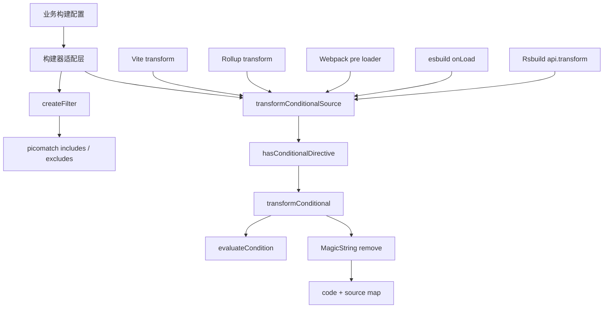
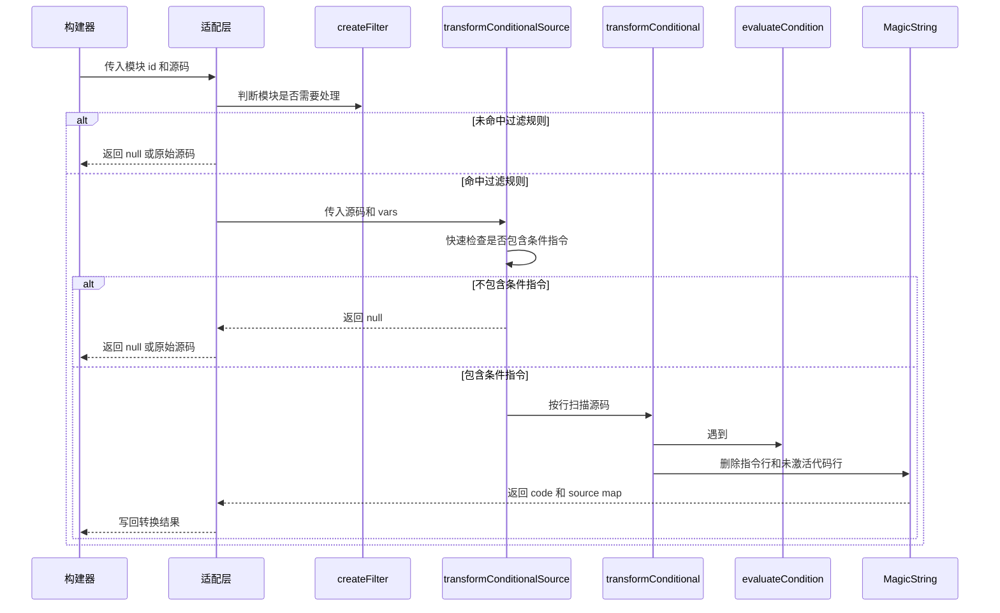
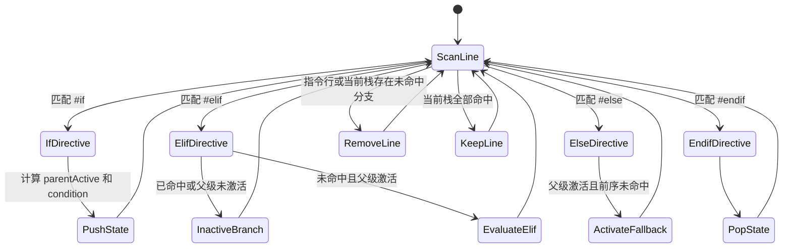

# 条件编译插件技术文档

## 1. 背景与目标

条件编译插件用于在构建阶段按变量裁剪源码。插件识别 `// #if`、`// #elif`、`// #else`、`// #endif` 单行注释指令，并在构建器加载、转换模块时移除未命中的代码分支，使最终产物只保留当前构建目标需要的代码。

该项目服务于多端管理后台的差异化构建场景。相比运行时动态路由或懒加载，条件编译可以在源码进入后续编译、打包、压缩流程之前完成裁剪，从而减少无效模块依赖、降低产物体积，并避免未选择业务路由被打入包内。

核心目标如下：

- 在同一份源码中维护多套功能、路由或环境分支。
- 通过构建变量在构建期生成不同业务产物。
- 在 Vite、Rollup、Webpack、esbuild、Rsbuild 中复用同一套条件编译规则。
- 将公共转换逻辑集中到核心模块，降低各构建器适配层的维护成本。

## 2. 项目范围

| 目录                                 | 作用                                          |
| ------------------------------------ | --------------------------------------------- |
| `packages/conditional-bundle-plugin` | 条件编译插件源码、构建配置和多构建器入口      |
| `packages/fe24-client`               | React 管理端，主要演示 Webpack 接入和路由裁剪 |
| `packages/fe24-client-vue`           | Vue 管理端，主要演示 Vite 接入和路由裁剪      |

## 3. 典型场景

### 3.1 路由级裁剪

管理端可以通过 `SELECTED_ROUTES` 或交互选择确定需要构建的路由。未选中的路由 import、路由记录和对应页面模块不会继续参与后续依赖分析。

适用示例：

- 只构建 Dashboard 页面用于专项部署。
- 只构建订单相关页面用于灰度交付。
- 默认构建全量路由，按需构建子集路由。

### 3.2 环境级分支

条件表达式可以读取 `vars` 中声明的环境变量，例如 `MY_ENV`、`app` 或业务自定义开关。适用于在同一份源码中保留开发、生产、渠道、租户等差异分支。

### 3.3 多构建器复用

插件将转换逻辑沉淀在 `src/core/index.ts`，不同构建器只负责把当前模块源码传给核心转换函数。业务项目切换构建器时，不需要重写条件编译语义。

## 4. 包入口与产物

`packages/conditional-bundle-plugin/package.json` 通过 `exports` 暴露多个子路径入口。插件构建后同时输出 ESM 和 CommonJS 产物，并生成类型声明。

| 入口                                      | 源码                   | 用途         |
| ----------------------------------------- | ---------------------- | ------------ |
| `@lark/conditional-bundle-plugin`         | `src/core/index.ts`    | 公共转换能力 |
| `@lark/conditional-bundle-plugin/vite`    | `src/vite/index.ts`    | Vite 插件    |
| `@lark/conditional-bundle-plugin/rollup`  | `src/rollup/index.ts`  | Rollup 插件  |
| `@lark/conditional-bundle-plugin/esbuild` | `src/esbuild/index.ts` | esbuild 插件 |
| `@lark/conditional-bundle-plugin/rsbuild` | `src/rsbuild/index.ts` | Rsbuild 插件 |
| `@lark/conditional-bundle-plugin/webpack` | `src/webpack/index.ts` | Webpack 插件 |

插件包依赖 `magic-string` 和 `picomatch`。构建器相关依赖以 peer dependency 形式声明，并通过 peer dependency meta 标记为可选，业务侧只需要安装自己实际使用的构建器。

## 5. 配置接口

```ts
export interface ConditionalBundleOptions {
  includes?: string[];
  excludes?: string[];
  vars?: Record<string, unknown>;
}
```

| 字段       | 说明                                               | 默认值     |
| ---------- | -------------------------------------------------- | ---------- |
| `includes` | 传给 `picomatch` 的包含规则。命中文件才会尝试转换  | `['**/*']` |
| `excludes` | 传给 `picomatch` 的排除规则。命中后跳过转换        | 无         |
| `vars`     | 条件表达式求值上下文。表达式只能访问这里声明的变量 | `{}`       |

配置建议：

- `includes` 应尽量收敛到业务源码类型，例如 `**/*.ts`、`**/*.tsx`、`**/*.vue`。
- `excludes` 可用于排除生成文件、测试文件或不希望参与条件编译的目录。
- `vars` 应只传入构建期可确定、可信任的值，不应接收未校验的外部表达式。

## 6. 总体架构



架构原则是“核心能力内聚，适配层保持薄”。核心模块负责文件过滤、条件指令识别、表达式求值、分支状态维护、源码删除和 source map 生成。适配层只接入构建生命周期，并把构建器特有的模块 ID、源码和返回格式转换为统一核心能力可以处理的数据。

## 7. 执行链路



转换发生在构建早期。Vite、Webpack 和 Rsbuild 都使用 `pre` 阶段，保证条件裁剪优先于 TypeScript、Vue、React、CSS 等后续编译处理。

## 8. 核心实现

### 8.1 文件过滤

`createFilter()` 基于 `picomatch` 生成过滤函数，支持从多个候选路径匹配同一个模块：

- 规范化后的绝对路径。
- 相对当前工作目录的路径。
- 文件 basename。

过滤前会先执行路径规范化：

- 去掉 query 和 hash，例如 `foo.ts?raw` 会按 `foo.ts` 匹配。
- 将 Windows 路径分隔符统一为 `/`。
- 跳过空 ID、虚拟模块和 `node_modules`。

这套策略可以兼容不同构建器传入的模块 ID 形式，避免业务侧必须精确区分绝对路径、相对路径或文件名。

### 8.2 指令识别

核心模块支持四类单行注释指令：

| 指令                 | 含义                                     |
| -------------------- | ---------------------------------------- |
| `// #if condition`   | 开启条件块，并在父级激活时计算条件表达式 |
| `// #elif condition` | 当前条件组尚未命中时继续计算候选分支     |
| `// #else`           | 当前条件组尚未命中时进入兜底分支         |
| `// #endif`          | 结束当前条件块                           |

指令通过正则逐行匹配，允许前置空格和注释符后的空格。插件只识别 `//` 单行注释，不处理块注释、JSX 注释或模板语言自定义注释。

### 8.3 条件求值

`evaluateCondition()` 使用 `vars` 构造表达式上下文：

```ts
const keys = Object.keys(vars);
const values = Object.values(vars);
const fn = new Function(...keys, `return ${condition};`);
return !!fn(...values);
```

求值规则如下：

- 表达式返回值会转为布尔值。
- 表达式只能直接访问 `vars` 中声明的变量名。
- 引用了不存在的变量时按 `false` 处理。
- 非变量缺失类异常会输出警告，并按 `false` 处理。

示例：

```ts
vars: {
  ROUTE_DASHBOARD: true,
  ROUTE_ORDER: false,
  MY_ENV: 'prod',
}
```

可用表达式：

```ts
// #if ROUTE_DASHBOARD
// #if MY_ENV === 'prod'
// #if ROUTE_DASHBOARD && MY_ENV === 'prod'
```

### 8.4 分支状态模型

`transformConditional()` 按行扫描源码，并用栈保存嵌套条件块状态。

| 栈字段         | 说明                                 |
| -------------- | ------------------------------------ |
| `matched`      | 当前分支是否命中                     |
| `hasHandled`   | 当前条件组是否已有分支命中           |
| `parentActive` | 进入当前条件组时父级条件是否全部激活 |

状态变化如下：



当前行是否保留由 `stack.every((state) => state.matched)` 决定。只要任意父级或当前分支未激活，该行就会被 `MagicString.remove()` 删除。

### 8.5 源码删除与 source map

源码通过 `MagicString` 执行范围删除。扫描时会记录每一行在原始源码中的起止偏移，删除范围覆盖整行内容和换行符。

被删除的内容包括：

- 所有条件编译指令行。
- 当前分支未命中的业务代码行。
- 父级条件未命中时的全部子级代码行。

如果源码未发生变化，核心函数返回 `null`，适配层可按构建器约定跳过写回。如果源码发生变化，则返回裁剪后的 `code` 和高精度 source map。

## 9. 构建器适配

| 构建器  | 入口                                            | 接入点                                                       | 处理范围                                      | 返回行为                                                      |
| ------- | ----------------------------------------------- | ------------------------------------------------------------ | --------------------------------------------- | ------------------------------------------------------------- |
| Vite    | `src/vite/index.ts`                             | `transform(code, id)`，`enforce: 'pre'`                      | 由 `includes` / `excludes` 决定               | 命中转换返回 `{ code, map }`，否则 `null`                     |
| Rollup  | `src/rollup/index.ts`                           | `transform(code, id)`                                        | 由 `includes` / `excludes` 决定               | 命中转换返回 `{ code, map }`，否则 `null`                     |
| Webpack | `src/webpack/index.ts`、`src/webpack/loader.ts` | 插件向 `module.rules` 头部注入 `enforce: 'pre'` loader       | 由 rule `resource` 和 loader 内部过滤双重判断 | 命中转换调用 `this.callback(null, code, map)`，否则返回原源码 |
| esbuild | `src/esbuild/index.ts`                          | `build.onLoad({ filter: /.*/ })`                             | `namespace === 'file'` 且通过过滤             | 命中转换返回 `contents`、`loader`、`resolveDir`，否则 `null`  |
| Rsbuild | `src/rsbuild/index.ts`                          | `api.transform({ enforce: 'pre', test: /\.[cm]?[jt]sx?$/ })` | JS/TS/JSX/TSX 且通过过滤                      | 命中转换返回 `{ code, map }`，否则返回原源码                  |

### 9.1 Vite 与 Rollup

Vite 和 Rollup 的适配方式最接近，都是在 `transform` 钩子中执行：

```ts
const result = transformConditionalSource(code, vars);
if (result) {
  return {
    code: result.code,
    map: result.map,
  };
}
return null;
```

Vite 插件额外声明 `enforce: 'pre'`，确保条件编译先于 Vue、JSX、CSS 等插件执行。

### 9.2 Webpack

Webpack 适配由插件和 loader 两部分组成：

- 插件在 `apply()` 中向 `compiler.options.module.rules` 头部插入一条 `enforce: 'pre'` rule。
- rule 的 `resource` 先通过 `createFilter()` 判断资源路径。
- loader 再根据 `this.resourcePath` 做一次过滤，并执行核心转换。
- 转换成功时通过 `this.callback(null, result.code, result.map)` 传回源码和 source map。

这种设计可以减少 loader 被不相关资源触发的概率，同时保持 loader 独立可测试。

### 9.3 esbuild

esbuild 适配使用 `onLoad` 钩子读取文件内容。转换成功后会根据文件扩展名推断 loader，例如 `.ts` 对应 `ts`、`.tsx` 对应 `tsx`、`.css` 对应 `css`。

该适配层不返回 source map，因为 esbuild 的 `onLoad` 返回结构当前只写回裁剪后的 `contents`、`loader` 和 `resolveDir`。

### 9.4 Rsbuild

Rsbuild 通过 `api.transform()` 注册前置转换，仅处理 JS/TS/JSX/TSX 资源。命中过滤规则后调用核心转换，未命中或无变化时直接返回原始 `code`。

## 10. React 管理端接入

React 管理端位于 `packages/fe24-client`，通过 Webpack 接入条件编译插件。

### 10.1 Webpack 配置

`webpack.config.ts` 在生成配置前先解析当前要构建的路由：

```ts
const { routeFlags } = await resolveSelectedRoutes({
  mode: isProduction ? "production" : "development",
  interactive: !isProduction,
});
```

随后在插件列表中注入 Webpack 适配层：

```ts
new WebpackConditionalBundlePlugin({
  includes: ["**/*.ts", "**/*.tsx"],
  vars: createConditionalVars(routeFlags),
});
```

### 10.2 路由变量生成

`shared.js` 维护可选择路由列表：

| 路由           | 条件变量             |
| -------------- | -------------------- |
| `dashboard`    | `ROUTE_DASHBOARD`    |
| `main`         | `ROUTE_MAIN`         |
| `main/grid`    | `ROUTE_MAIN_GRID`    |
| `map`          | `ROUTE_MAP`          |
| `order`        | `ROUTE_ORDER`        |
| `order/detail` | `ROUTE_ORDER_DETAIL` |

解析优先级如下：

1. 如果存在 `SELECTED_ROUTES`，按逗号分隔解析。
2. 开发模式且允许交互时，通过 `@inquirer/prompts` 选择路由。
3. 交互失败时使用默认开发路由。
4. 非交互且未指定路由时使用全量路由。

`createConditionalVars()` 会合并环境变量和路由变量：

```ts
return {
  MY_ENV: process.env.MY_ENV || "prod",
  app: process.env.app || "1",
  ...routeFlags,
};
```

### 10.3 路由裁剪位置

React 路由裁剪集中在 `src/router/routes.tsx`。同一个路由需要同时包裹懒加载 import 和路由记录：

```tsx
// #if ROUTE_DASHBOARD
const DashboardMain = React.lazy(() => import('@/pages/dashboard/dashboard-main'));
// #endif

// #if ROUTE_DASHBOARD
{ path: 'dashboard', element: <DashboardMain /> },
// #endif
```

当 `ROUTE_DASHBOARD` 为 `false` 时，`DashboardMain` 的懒加载声明和路由记录都会被删除，后续 Webpack 不会继续从该 import 分析 Dashboard 页面依赖。

## 11. Vue 管理端接入

Vue 管理端位于 `packages/fe24-client-vue`，通过 Vite 接入条件编译插件。

### 11.1 Vite 配置

`vite.config.ts` 在 `defineConfig(async ({ command }) => {})` 中解析选中路由，并构造 `activeRoutes`：

```ts
const activeRoutes = routesToCompile.reduce<Record<string, boolean>>(
  (acc, route) => {
    acc[`ROUTE_${route.toUpperCase().replace(/\//g, "_")}`] = true;
    return acc;
  },
  {},
);
```

随后注册 Vite 插件：

```ts
ViteConditionalBundlePlugin({
  includes: ["**/*.ts", "**/*.tsx", "**/*.vue"],
  vars: {
    MY_ENV: process.env.MY_ENV || "prod",
    app: process.env.app || "1",
    ...activeRoutes,
  },
});
```

### 11.2 路由选择策略

Vue 管理端的路由选择策略如下：

1. `SELECTED_ROUTES` 存在时优先使用环境变量。
2. 非 build 命令不触发交互选择。
3. build 命令且支持 TTY、非 CI 环境时弹出交互选择。
4. 交互不可用或失败时使用全量默认路由。

### 11.3 路由裁剪位置

Vue 路由裁剪集中在 `src/router/routes.ts`：

```ts
// #if ROUTE_DASHBOARD
{
  path: '/dashboard',
  name: 'Dashboard',
  component: () => import('@/pages/dashboard/dashboard-main.vue'),
  meta: {
    tagName: '数据看板',
    icon: 'DataScreen',
  },
},
// #endif
```

当对应变量未启用时，整段路由记录会被删除，动态 import 不再进入 Vite 的依赖图。

## 12. 路由裁剪链路


该链路的关键点是：条件编译必须发生在构建器建立完整依赖图之前。只有先删除未命中的动态 import，后续打包阶段才不会继续解析对应页面模块。

## 13. 指令编写规范

### 13.1 基本规范

- 指令必须使用 `//` 单行注释。
- 指令应独占一行，避免与业务代码混写。
- 条件表达式只访问 `vars` 中声明的变量。
- 每个 `#if` 必须有对应的 `#endif`。
- 复杂嵌套条件应保持缩进清晰，避免影响可读性。

### 13.2 推荐写法

推荐把变量声明和使用点同时包裹，避免裁剪后出现未定义标识符：

```tsx
// #if ROUTE_ORDER
const OrderMain = React.lazy(() => import('@/pages/order/order-main'));
// #endif

// #if ROUTE_ORDER
{ path: 'order', element: <OrderMain /> },
// #endif
```

对于同一业务模块，建议统一使用相同条件变量，避免 import 被保留但路由记录被删除，或路由记录保留但组件声明被删除。

### 13.3 不推荐写法

不建议只包裹组件使用点而不包裹 import：

```tsx
const OrderMain = React.lazy(() => import('@/pages/order/order-main'));

// #if ROUTE_ORDER
{ path: 'order', element: <OrderMain /> },
// #endif
```

这种写法可以删除路由记录，但 import 仍可能进入依赖分析，无法达到完整裁剪效果。

## 14. 构建命令

### 14.1 插件包

```bash
pnpm --filter @lark/conditional-bundle-plugin build
pnpm --filter @lark/conditional-bundle-plugin dev
```

### 14.2 React 管理端

```bash
pnpm --filter @lark/fe24-client dev
pnpm --filter @lark/fe24-client build
pnpm --filter @lark/fe24-client build:all
SELECTED_ROUTES=dashboard,order pnpm --filter @lark/fe24-client build
```

### 14.3 Vue 管理端

```bash
pnpm --filter @lark/fe24-client-vue dev
pnpm --filter @lark/fe24-client-vue build
pnpm --filter @lark/fe24-client-vue build:all
pnpm --filter @lark/fe24-client-vue build:cond
SELECTED_ROUTES=dashboard,order pnpm --filter @lark/fe24-client-vue build
```

## 15. 验证方法

### 15.1 源码级验证

选择单一路由构建后，可以检查构建日志、产物文件或 bundle analyzer 报告，确认未选路由对应页面模块没有进入依赖图。

示例：只构建 Dashboard 时，应重点确认以下模块未出现在产物依赖中：

- `pages/order/order-main`
- `pages/order/order-detail`
- `pages/map/map-main`
- `pages/main/robot-grid`

### 15.2 运行时验证

构建完成后启动预览或静态服务，验证：

- 已选择路由可以正常访问。
- 未选择路由不会出现在菜单或路由表中。
- 未选择路由的 URL 访问会进入兜底路由或空页面。
- 控制台没有因为裁剪导致的未定义变量、组件或路由错误。

### 15.3 配置级验证

需要同时验证不同输入方式：

| 输入方式                          | 预期结果                                 |
| --------------------------------- | ---------------------------------------- |
| 不设置 `SELECTED_ROUTES`          | 使用默认策略，通常构建全量或默认开发路由 |
| `SELECTED_ROUTES=*`               | 构建全部可选路由                         |
| `SELECTED_ROUTES=dashboard`       | 只启用 Dashboard 路由变量                |
| `SELECTED_ROUTES=dashboard,order` | 同时启用 Dashboard 和 Order 路由变量     |

## 16. 适用边界

适合使用条件编译的场景：

- 构建时可以确定的功能开关。
- 按路由、渠道、租户、环境裁剪代码。
- 多构建器项目需要复用一致的裁剪规则。
- 希望未命中分支不进入最终产物的场景。

不适合使用条件编译的场景：

- 运行时才能决定的权限控制。
- 运行时 A/B 实验或实时灰度策略。
- 需要在同一产物内保留所有分支并动态切换的场景。
- 条件表达式来自不可信输入的场景。

## 17. 风险与注意事项

### 17.1 表达式安全

插件使用 `new Function()` 对条件表达式求值，因此 `vars` 和指令表达式必须来自可信源码和可信构建配置。不要把用户输入、远端配置或未审计字符串直接拼接为条件表达式。

### 17.2 语法完整性

插件按行删除源码，不理解 TypeScript、JSX 或 Vue SFC 的 AST 结构。指令边界必须保证删除后源码仍是合法语法。

常见风险包括：

- 删除数组元素后留下多余逗号或缺少逗号。
- 删除对象属性后破坏对象结构。
- 只删除使用点，未删除对应 import 或变量声明。
- 在 JSX、模板或样式块中使用了不被识别的注释格式。

### 17.3 嵌套条件

嵌套条件由栈维护，父级未命中时子级条件不会被激活。编写嵌套条件时应优先保证父级表达式语义清晰，避免多个变量组合后难以判断最终保留内容。

### 17.4 source map

核心转换会生成高精度 source map，但不同构建器对 source map 的消费方式不同。Webpack、Vite、Rollup 和 Rsbuild 会向后传递 map，esbuild 当前适配层只返回裁剪后的内容和 loader 信息。

## 18. 后续优化方向

- 增加针对 `transformConditional()` 的单元测试，覆盖 `#if`、`#elif`、`#else`、嵌套条件和异常指令。
- 增加指令配对检查，在构建阶段提示未闭合的 `#if`。
- 支持更严格的表达式求值白名单，降低 `new Function()` 的安全风险。
- 为 esbuild 适配层补充 source map 传递能力。
- 补充 Vue SFC 模板、样式块和 JSX 场景下的指令使用示例。
