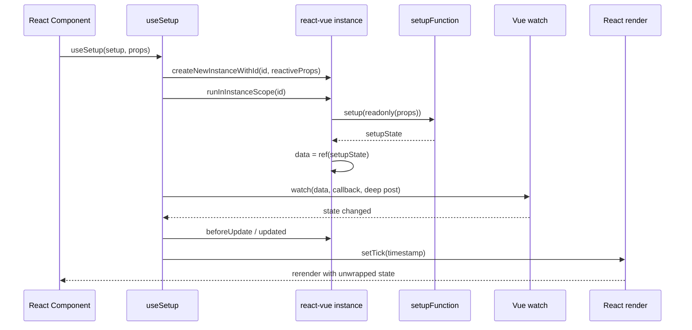
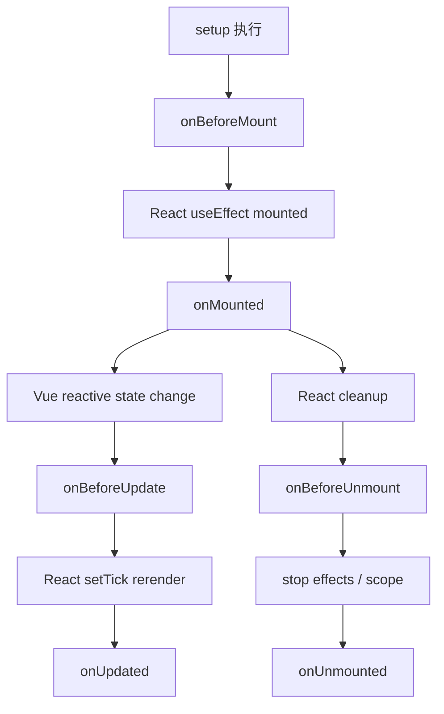
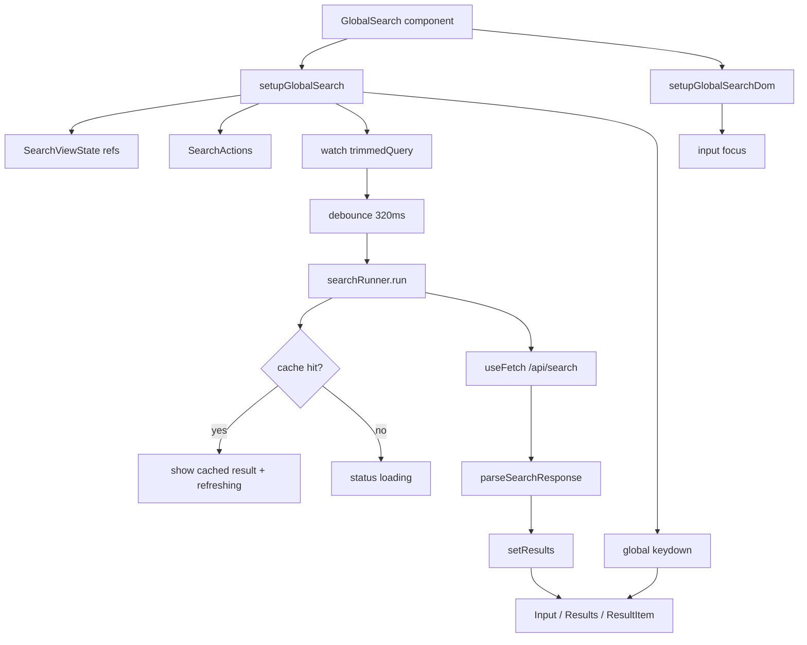
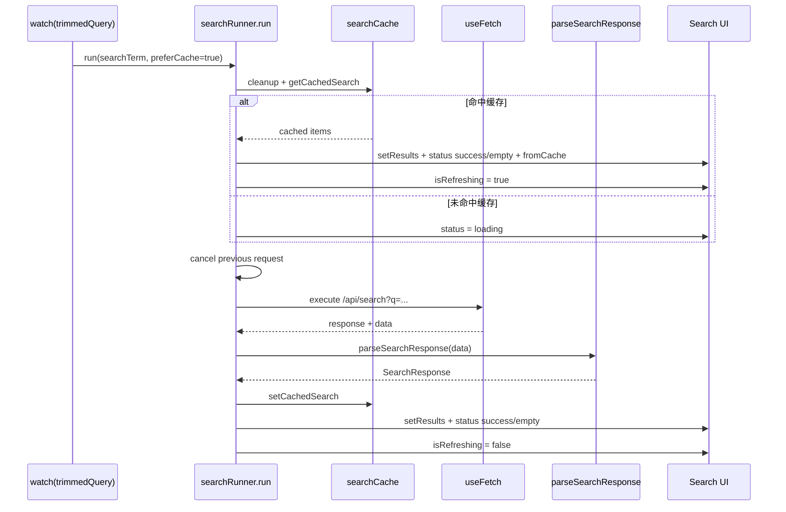
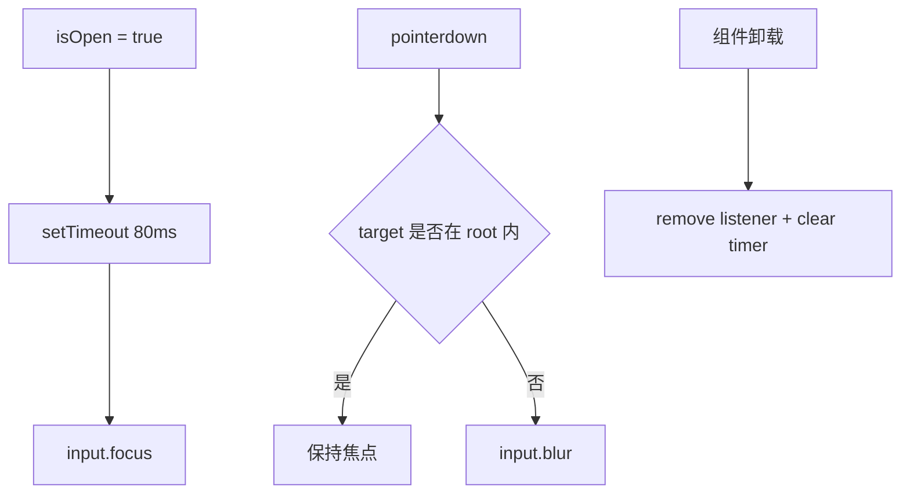

# 全局搜索框技术文档

## 1. 背景与目标

全局搜索框项目由 `packages/react-vue` 工具库和 `packages/react-vue-demo` 示例应用组成。项目目标不是单纯实现一个搜索 UI，而是验证一条更完整的技术路径：在 React 组件中复用 Vue Composition API 的响应式表达，并用一个具备真实交互复杂度的全局搜索框检验这套适配层的可用性。

`react-vue` 提供 `useSetup`、`createSetup`、`defineComponent`、`computed`、`watch`、生命周期钩子、`provide` / `inject` 等能力，让 React 组件可以用接近 Vue `setup()` 的方式组织状态和副作用。`react-vue-demo` 在此基础上实现全局搜索、路由跳转、MSW mock、VueUse 示例和 Pinia 示例。

核心目标如下：

- 在 React 中运行 Vue Composition API 风格的 `setup()` 函数。
- 使用 Vue reactivity 管理组件状态，并通过 deep watch 驱动 React 重渲染。
- 通过全局搜索框验证响应式状态、computed、watch、生命周期、DOM ref、键盘事件和异步请求组合能力。
- 将搜索逻辑拆分为缓存、请求、响应解析、键盘、DOM 和结果对比等模块，降低单个 Hook 的复杂度。
- 使用 MSW 与 faker 提供稳定、可复现、可模拟失败的搜索数据。
- 使用 Vite alias 验证 VueUse、Pinia 等 Vue 生态库在适配层上的基本兼容性。

## 2. 项目范围

### 2.1 react-vue 工具库

| 路径                                         | 说明                                                    |
| -------------------------------------------- | ------------------------------------------------------- |
| `packages/react-vue/src/index.ts`            | 对外导出入口，转发适配层 API 和 `@vue/reactivity` API   |
| `packages/react-vue/src/use-setup.ts`        | 核心 Hook，在 React 中运行 setup 函数并绑定实例生命周期 |
| `packages/react-vue/src/create-setup.ts`     | 将 setup 函数包装为 React Hook                          |
| `packages/react-vue/src/define-component.ts` | 将 setup + render 包装为 React 组件                     |
| `packages/react-vue/src/component.ts`        | 内部组件实例、effect scope、HMR 状态和卸载逻辑          |
| `packages/react-vue/src/lifecycle.ts`        | 生命周期注册与触发逻辑                                  |
| `packages/react-vue/src/watch.ts`            | `watch` / `watchEffect` 类型与运行时转发                |
| `packages/react-vue/src/computed.ts`         | `computed` 转发与类型重载                               |
| `packages/react-vue/src/mock.ts`             | `createApp`、`provide`、`inject` 等 Vue runtime mock    |
| `packages/react-vue/tests`                   | 适配层单元测试                                          |
| `packages/react-vue/rollup.config.js`        | CJS、ESM、浏览器产物和类型声明构建配置                  |

### 2.2 react-vue-demo 示例应用

| 路径                                                     | 说明                                                 |
| -------------------------------------------------------- | ---------------------------------------------------- |
| `packages/react-vue-demo/src/components/search`          | 全局搜索 UI 组件                                     |
| `packages/react-vue-demo/src/hooks/use-global-search.ts` | 全局搜索主状态 Hook                                  |
| `packages/react-vue-demo/src/hooks/global-search`        | 搜索缓存、请求、键盘、DOM、响应解析等拆分模块        |
| `packages/react-vue-demo/src/mocks`                      | MSW mock API 与 faker 数据                           |
| `packages/react-vue-demo/src/pages/home.tsx`             | 首页，挂载全局搜索框                                 |
| `packages/react-vue-demo/src/pages/demo.tsx`             | 适配层能力展示页                                     |
| `packages/react-vue-demo/src/router/index.ts`            | React Router 路由配置                                |
| `packages/react-vue-demo/src/pinia`                      | Pinia 兼容性示例                                     |
| `packages/react-vue-demo/src/hooks/use-mouse.tsx`        | VueUse `useMouse` 示例                               |
| `packages/react-vue-demo/src/hooks/use-battery.tsx`      | VueUse `useBattery` 示例                             |
| `packages/react-vue-demo/src/hooks/use-query.tsx`        | VueUse `useFetch` 示例                               |
| `packages/react-vue-demo/vite.config.ts`                 | Vite、React、TailwindCSS、alias 和 mock 辅助接口配置 |

## 3. 总体架构

```mermaid
flowchart TD
  ReactApp[React App] --> Demo[react-vue-demo]
  Demo --> GlobalSearch[GlobalSearch]
  GlobalSearch --> SearchSetup[setupGlobalSearch]
  GlobalSearch --> DomSetup[setupGlobalSearchDom]
  SearchSetup --> ReactVue[react-vue]
  DomSetup --> ReactVue
  ReactVue --> VueReactivity[@vue/reactivity]
  ReactVue --> VueRuntime[@vue/runtime-core]

  SearchSetup --> Runner[createSearchRunner]
  Runner --> Cache[search cache]
  Runner --> Fetch[@vueuse/core useFetch]
  Fetch --> MSW[MSW /api/search]
  MSW --> Faker[faker seeded data]

  GlobalSearch --> Input[Input]
  GlobalSearch --> Results[Results]
  Results --> ResultItem[ResultItem]
  Results --> Feedback[Feedback states]
```

项目分为两层：

- 适配层：`react-vue` 负责把 Vue 响应式能力接入 React 渲染和生命周期。
- 业务层：`react-vue-demo` 使用适配层实现全局搜索，并验证 VueUse、Pinia 等生态能力。

## 4. react-vue 适配层

### 4.1 对外 API

`src/index.ts` 对外导出以下能力：

| API                                | 说明                                                 |
| ---------------------------------- | ---------------------------------------------------- |
| `useSetup`                         | 在 React 组件中运行 setup 函数，返回自动解包后的状态 |
| `createSetup`                      | 将 setup 函数包装为可复用 Hook                       |
| `defineComponent`                  | 使用 `setup + render` 定义 React 组件                |
| `computed`                         | 转发 Vue computed，支持只读和可写 computed 类型重载  |
| `watch` / `watchEffect`            | 转发 Vue runtime-core 的 watch 能力                  |
| `onMounted` 等生命周期             | 在 React 生命周期中模拟 Vue 生命周期                 |
| `getCurrentInstance`               | 获取当前 react-vue 内部实例                          |
| `nextTick`                         | 使用 `setTimeout(0)` 模拟下一轮任务                  |
| `createApp`                        | 提供 Vue runtime app mock，支持 `use` 和 `provide`   |
| `provide` / `inject`               | 基于当前实例和 app context 的依赖注入                |
| `ref`、`reactive`、`shallowRef` 等 | 从 `@vue/reactivity` 直接转发                        |

`react-vue` 的 `package.json` 以 `react >= 18` 作为 peer dependency，实际 Demo 使用 React 19。

### 4.2 useSetup 核心机制

`useSetup(setupFunction, ReactProps)` 是整个库的核心。它完成以下工作：

1. 为当前 React 组件生成稳定的 react-vue 实例 ID。
2. 将 React props 包装为 Vue `reactive` 对象，并以 `readonly(props)` 传入 setup。
3. 创建内部实例，保存 props、data、hooks、effect scope、provides 等状态。
4. 在实例作用域中执行 setup 函数。
5. 将 setup 返回值包装为 `ref(setupState)`，保存到 `instance.data`。
6. 用 deep watch 监听 setup 返回值变化。
7. 数据变化时触发 React state tick，从而重新渲染组件。
8. 触发 Vue 风格生命周期钩子。
9. React 组件卸载时停止实例 effect 并触发卸载钩子。



`useSetup` 返回值类型为 `UnwrapRef<State>`，因此组件渲染函数中可以直接读取 `msg`、`count`、`computedValue`，不用在 JSX 中手动写 `.value`。

### 4.3 实例模型

内部实例结构定义在 `InternalInstanceState`：

```ts
export interface InternalInstanceState {
  _id: number;
  props: Record<string, unknown>;
  data: Ref<unknown>;
  isMounted: boolean;
  isUnmounted: boolean;
  isUnmounting: boolean;
  effects?: { active?: boolean; stop: () => void }[];
  hooks: Record<string, ((...args: unknown[]) => unknown)[]>;
  initialState: Record<string | symbol, unknown>;
  provides: Record<string, unknown>;
  scope: EffectScope | null;
}
```

关键字段：

| 字段           | 说明                                       |
| -------------- | ------------------------------------------ |
| `_id`          | 实例 ID，用于在全局实例表中定位当前实例    |
| `props`        | reactive props，React props 更新时同步写入 |
| `data`         | setup 返回对象的 ref 包装                  |
| `hooks`        | 生命周期钩子数组                           |
| `effects`      | 实例绑定的 effect，卸载时统一 stop         |
| `initialState` | 开发环境 HMR 变更检测使用                  |
| `provides`     | 依赖注入上下文                             |
| `scope`        | Vue effectScope，卸载时 stop               |

开发环境下实例状态会挂到 `window.__react_vue_state` 和 `window.__react_vue_id`，用于 HMR 后保留实例上下文。

### 4.4 生命周期映射

`react-vue` 支持以下生命周期：

| Vue 风格钩子      | 触发时机                                           |
| ----------------- | -------------------------------------------------- |
| `onBeforeMount`   | setup 执行后、实例 data 建立前后进入挂载流程时触发 |
| `onMounted`       | React effect 确认实例首次挂载后触发                |
| `onBeforeUpdate`  | data deep watch 触发且实例已 mounted 时触发        |
| `onUpdated`       | React tick 触发后紧接着调用                        |
| `onBeforeUnmount` | React cleanup 触发实例卸载时调用                   |
| `onUnmounted`     | effect 停止后调用                                  |



生命周期钩子通过 `injectHook()` 写入当前实例的 `hooks`，执行时会通过 `pauseTracking()` / `resetTracking()` 避免生命周期内部误收集依赖。

### 4.5 defineComponent 与 createSetup

`defineComponent(setup, render)` 返回一个 React 组件：

```ts
export function defineComponent(setupFunction, renderFunction) {
  return (props) => {
    const state = useSetup(setupFunction, props);
    return renderFunction(state);
  };
}
```

`createSetup(setup)` 返回一个 React Hook：

```ts
export function createSetup(setupFunction) {
  return (props) => useSetup(setupFunction, props);
}
```

使用建议：

- 组件内部逻辑简单时，用 `defineComponent` 直接组合 setup 和 render。
- 需要复用业务逻辑时，用 `createSetup` 封装为 Hook，例如 `useGlobalSearch`。
- 需要和普通 React 组件混用时，直接使用 `useSetup`。

### 4.6 provide / inject 与 createApp

`createApp()` 是一个轻量 Vue app mock，主要服务 Vue 生态库兼容：

- 支持 `app.use(plugin)`，可安装函数插件或带 `install` 方法的插件。
- 支持 `app.provide(key, value)` 写入全局 provides。
- 不支持 `mount`、`unmount`、`component`、`directive`、`mixin`，开发环境会输出 warning。

`provide()` 写入当前实例的 `provides`，`inject()` 优先从当前实例读取，找不到时返回默认值或在开发环境输出警告。

Demo 中通过 `createApp().use(createPinia())` 安装 Pinia，并通过 Vite alias 让 Pinia 依赖的 Vue runtime 入口指向 `react-vue`。

## 5. 全局搜索业务架构



`setupGlobalSearch()` 输出两个对象：

| 输出      | 说明                                                                |
| --------- | ------------------------------------------------------------------- |
| `state`   | 搜索框所有视图状态，包括 open、query、results、status、cache 标记等 |
| `actions` | 搜索框动作，包括 open、close、setQuery、selectResult、retry 等      |

`GlobalSearch` 再组合 `setupGlobalSearchDom()`，让业务状态与 DOM ref 逻辑解耦。

## 6. 搜索状态模型

### 6.1 SearchResult

```ts
export interface SearchResult {
  id: string;
  title: string;
  description: string;
  category: string;
  url: string;
  tags: string[];
  updatedAt: string;
}
```

| 字段          | 说明                             |
| ------------- | -------------------------------- |
| `id`          | 搜索结果唯一 ID                  |
| `title`       | 展示标题                         |
| `description` | 摘要描述                         |
| `category`    | 分类标签                         |
| `url`         | 选中后跳转地址                   |
| `tags`        | 搜索召回标签                     |
| `updatedAt`   | 更新时间，用于展示和结果变更判断 |

### 6.2 SearchStatus

```ts
export type SearchStatus = "idle" | "loading" | "success" | "empty" | "error";
```

| 状态      | 含义                   | UI 行为                |
| --------- | ---------------------- | ---------------------- |
| `idle`    | 未输入有效查询或已重置 | 不展示结果面板         |
| `loading` | 正在请求且无可用缓存   | 展示 skeleton loading  |
| `success` | 请求成功且有结果       | 展示结果列表           |
| `empty`   | 请求成功但无结果       | 展示空状态             |
| `error`   | 请求失败且无缓存兜底   | 展示错误状态和重试按钮 |

### 6.3 SearchViewState

`SearchViewState` 是 UI 层消费的完整状态：

| 字段             | 说明                                    |
| ---------------- | --------------------------------------- |
| `isOpen`         | 搜索结果面板是否打开                    |
| `query`          | 输入框原始值                            |
| `trimmedQuery`   | 去除首尾空格后的查询词                  |
| `results`        | 当前结果列表                            |
| `total`          | 服务端匹配总数                          |
| `status`         | 搜索状态                                |
| `errorMessage`   | 错误提示                                |
| `activeIndex`    | 当前键盘选中的结果索引                  |
| `fromCache`      | 当前结果是否来自缓存                    |
| `isRefreshing`   | 是否在展示缓存的同时后台刷新            |
| `isLoading`      | computed，等价于 `status === 'loading'` |
| `canShowResults` | computed，控制结果面板显隐              |

## 7. 搜索执行链路

### 7.1 输入与防抖

`setupGlobalSearch()` 监听 `trimmedQuery`：

```ts
watch(trimmedQuery, (searchTerm) => {
  activeIndex.value = 0;

  if (debounceTimer) clearTimeout(debounceTimer);

  if (searchTerm.length === 0) {
    resetSearch();
    return;
  }

  debounceTimer = setTimeout(() => {
    void searchRunner.run(searchTerm, true);
  }, debounceMs);
});
```

默认配置：

| 配置              | 默认值 | 说明         |
| ----------------- | ------ | ------------ |
| `debounceMs`      | `320`  | 输入防抖时间 |
| `cacheTtlSeconds` | `30`   | 搜索缓存 TTL |

查询为空时会取消请求、清空结果、恢复 `idle`。

### 7.2 请求与缓存

`createSearchRunner()` 负责执行搜索：



缓存策略：

- 缓存 key 为小写查询词。
- TTL 默认 30 秒。
- 最大缓存条目数为 40。
- 每次写入缓存后会清理过期项，并在超出上限时删除最早插入项。
- 命中缓存时先展示缓存结果，同时继续请求最新数据。

### 7.3 并发取消

搜索请求使用两个机制处理并发：

- `request.abort()`：取消上一轮 `useFetch` 请求。
- `requestVersion`：每次 cancel 自增版本号，异步结果返回时如果版本不匹配则丢弃。

这样可以避免慢请求覆盖快请求结果。

### 7.4 响应解析与错误处理

`parseSearchResponse()` 是防御式解析：

- 响应不是对象时返回空结果。
- `items` 不是数组时返回空数组。
- 每个 item 必须包含合法的 `id`、`title`、`description`、`category`、`url`、`tags`、`updatedAt`。
- `total` 非数字时使用有效 item 数量兜底。
- `query` 非字符串时返回空字符串。

错误处理：

| 场景               | 行为                                  |
| ------------------ | ------------------------------------- |
| HTTP 非 2xx        | 尝试读取响应 JSON 中的 `message`      |
| 响应 JSON 解析失败 | 使用 `Request failed with status ...` |
| 普通 Error         | 使用 `error.message`                  |
| 其他异常           | 使用通用网络错误文案                  |
| 有缓存时请求失败   | 保留缓存结果，并展示 inline warning   |
| 无缓存时请求失败   | 清空结果并进入 `error` 状态           |

## 8. 键盘与 DOM 行为

### 8.1 全局快捷键

`createGlobalSearchKeydownHandler()` 处理全局键盘事件：

| 按键           | 行为                             |
| -------------- | -------------------------------- |
| `Cmd/Ctrl + P` | 打开搜索框，并阻止浏览器默认行为 |
| `Escape`       | 关闭搜索框                       |
| `ArrowDown`    | 向下循环选择结果                 |
| `ArrowUp`      | 向上循环选择结果                 |
| `Enter`        | 选择当前激活结果                 |

事件监听在 `onMounted()` 中注册，在 `onUnmounted()` 中移除。

### 8.2 DOM 聚焦与外部点击

`setupGlobalSearchDom()` 负责 DOM 引用：

- `rootElement` 保存搜索框根节点。
- `inputElement` 保存输入框节点。
- `isOpen` 变为 `true` 后，延迟 80ms 聚焦输入框。
- 全局监听 `pointerdown`，当点击搜索框外部时 blur 输入框。
- 卸载时移除事件监听并清理 focus timer。



## 9. 搜索 UI 组件

### 9.1 GlobalSearch

`GlobalSearch` 是搜索框容器组件：

- 调用 `setupGlobalSearch()` 创建状态和动作。
- 调用 `setupGlobalSearchDom()` 创建 DOM ref 处理器。
- 渲染 `Input` 和 `Results`。
- 选中结果后通过 `window.history.pushState()` 和 `popstate` 事件触发路由变化。

### 9.2 Input

`Input` 负责输入区：

- 展示搜索图标、输入框、加载图标、清空按钮和快捷键提示。
- `onChange` 调用 `actions.setQuery()`。
- `onFocus` 调用 `actions.openSearch()`。
- `state.isRefreshing || state.isLoading` 时展示旋转 loading 图标。
- 输入非空时展示清空按钮。
- 设置 `aria-expanded`、`aria-controls`、`aria-autocomplete` 提升可访问性。

### 9.3 Results

`Results` 负责结果面板：

- 根据 `state.canShowResults` 控制展开和收起动画。
- 渲染 `ResultsHeader`、inline warning、loading、error、empty 和结果列表。
- 通过 computed 计算 `showInlineError`：有错误消息但整体状态不是 `error`，通常表示“缓存兜底 + 后台刷新失败”。

### 9.4 ResultItem

`ResultItem` 展示单条结果：

- 鼠标悬停时调用 `actions.setActiveIndex(index)`。
- 点击时调用 `actions.selectResult(result)`。
- 使用 `Highlight` 高亮标题和描述中的查询词。
- 展示分类 badge、更新时间和 URL。
- 使用 `role="option"` 与 `aria-selected` 表达当前激活状态。

### 9.5 Feedback

反馈组件覆盖四类状态：

| 组件                 | 场景                                        |
| -------------------- | ------------------------------------------- |
| `InlineSearchError`  | 有缓存结果但刷新失败，展示 warning 和 retry |
| `SearchLoadingState` | 首次请求中，展示 skeleton                   |
| `SearchErrorState`   | 无缓存且请求失败，展示 error 和 retry       |
| `SearchEmptyState`   | 请求成功但没有匹配结果                      |

### 9.6 Highlight

`Highlight` 通过 computed 将文本切分为普通片段和命中片段：

- 大小写不敏感匹配。
- 支持同一文本中多个命中位置。
- 命中片段使用 `<mark>` 渲染。
- 查询为空时直接返回完整文本片段。

## 10. Mock 搜索数据

开发环境下 `index.tsx` 会启动 MSW：

```ts
async function enableMocking() {
  if (!import.meta.env.DEV) return;

  const { worker } = await import("./mocks/browser");
  await worker.start({ onUnhandledRequest: "bypass" });
}
```

Mock 特点：

- 使用 faker 固定 seed，保证每次启动生成一致数据。
- 使用固定默认日期，保证 `updatedAt` 数据可复现。
- 生成 10,000 条搜索记录。
- 请求 `/api/search?q=...` 时延迟 280ms 到 780ms，模拟真实网络波动。
- 查询词包含 `error` 时返回 503，用于验证错误态和 retry。
- 按 title、category、tags、description 加权排序。
- 最多返回前 8 条结果，同时返回总命中数。

```mermaid
flowchart TD
  Query[/api/search q] --> Normalize[trim + lowerCase]
  Normalize --> ErrorCheck{包含 error?}
  ErrorCheck -->|是| Error503[返回 503 message]
  ErrorCheck -->|否| Words[拆分关键词]
  Words --> Rank[rankItem 加权评分]
  Rank --> Filter[过滤 score > 0]
  Filter --> Sort[按 score 降序]
  Sort --> Slice[截取前 8 条]
  Slice --> Response[SearchResponse]
```

排序权重：

| 字段          | 命中加分 |
| ------------- | -------- |
| `title`       | `+8`     |
| `category`    | `+5`     |
| `tags`        | `+3`     |
| `description` | `+1`     |

## 11. 路由与页面

`react-vue-demo` 使用 React Router：

| 路径    | 页面   | 说明                       |
| ------- | ------ | -------------------------- |
| `/`     | `Home` | 全局搜索框主体验页面       |
| `/demo` | `Demo` | react-vue 适配能力展示页面 |

`Home` 中挂载：

```tsx
<GlobalSearch cacheTtlSeconds={30} />
```

搜索结果选中后会调用：

```ts
window.history.pushState(null, "", result.url);
window.dispatchEvent(new PopStateEvent("popstate"));
```

这样可以在不直接依赖 `useNavigate()` 的情况下触发路由变化。

## 12. Vue 生态兼容验证

Demo 页面额外展示 `react-vue` 对 Vue 生态库的兼容性。

### 12.1 Counter 示例

| 组件       | 验证点                                                  |
| ---------- | ------------------------------------------------------- |
| `Counter`  | `defineComponent`、`ref`、`computed`、`watch`、生命周期 |
| `Counter2` | 普通 React 组件中直接使用 `useSetup`                    |
| `Counter3` | 使用 `createSetup` 封装复用 Hook                        |

这些组件验证：Vue ref 更新可以驱动 React UI 更新，React props 可以同步到 setup 内部，生命周期在挂载、更新和卸载时触发。

### 12.2 VueUse 示例

| 组件      | 依赖         | 验证点                                      |
| --------- | ------------ | ------------------------------------------- |
| `Mouse`   | `useMouse`   | VueUse shallowRef 坐标更新可驱动 React 渲染 |
| `Battery` | `useBattery` | 浏览器电池状态 ref 可展示在 React UI 中     |
| `Query`   | `useFetch`   | VueUse 异步请求状态可被 React 消费          |

### 12.3 Pinia 示例

Pinia store 使用 `defineStore()`：

```ts
export const useMainStore = defineStore("main", () => {
  const count = ref(0);
  const doubled = computed(() => count.value * 2);
  function reset() {
    count.value = 0;
  }
  return { count, doubled, reset };
});
```

`Pinia A` 和 `Pinia B` 同时消费同一个 store，通过 `$patch()` 分别递减和递增 `count`，验证 store 状态可以跨 React 组件共享。

## 13. Vite 配置

`vite.config.ts` 的关键配置：

```ts
resolve: {
  alias: {
    vue: '@lark/react-vue',
    '@vue/composition-api': '@lark/react-vue',
    '@vue/runtime-dom': '@lark/react-vue',
    '@': resolve(__dirname, 'src'),
  },
},
optimizeDeps: {
  include: ['@lark/react-vue'],
},
```

alias 的作用：

- 让 VueUse、Pinia 等依赖 `vue` 或 Vue runtime 的包解析到本地 `react-vue` 适配层。
- 让 Demo 可以用 `@/` 引用 `src` 下模块。
- 显式将 workspace 依赖加入 optimizeDeps，避免 Vite 不预构建本地链接依赖导致开发体验不稳定。

Vite 插件还提供 `/json` 调试接口，延迟 5 秒返回 Node 内存和 V8 heap 信息，用于 `useFetch` 示例。

## 14. 样式体系

Demo 使用 TailwindCSS 4 和 daisyUI：

```css
@import "tailwindcss";
@plugin "../node_modules/daisyui/index.js";
```

样式特点：

- 搜索框使用 daisyUI `input`、`btn`、`kbd`、`badge`、`alert`、`skeleton`、`menu` 等类名。
- 页面使用 `bg-base-200`、`bg-base-100`、`text-base-content` 等主题 token。
- 自定义字体使用 Iosevka、Menlo、Cascadia Code、微软雅黑和苹方。
- 覆盖 input / textarea focus 样式，将焦点边框统一为橙色。

## 15. 测试覆盖

`react-vue` 工具库包含 Vitest 测试：

| 测试文件                    | 覆盖内容                             |
| --------------------------- | ------------------------------------ |
| `use-setup.spec.tsx`        | setup 返回值渲染、props 同步         |
| `create-setup.spec.tsx`     | createSetup 包装 Hook                |
| `define-component.spec.tsx` | defineComponent 渲染                 |
| `computed.spec.tsx`         | computed 随 props 更新               |
| `watch.spec.tsx`            | watch 和 watchEffect 响应 props 变化 |
| `lifecycle.spec.tsx`        | mount、update、unmount 生命周期      |
| `mock.spec.tsx`             | provide / inject                     |
| `use-fetch-sim.spec.tsx`    | 异步 ref 状态驱动 React 渲染         |

这些测试主要验证适配层核心能力。全局搜索 Demo 当前没有独立自动化测试，后续可补充组件交互和搜索链路测试。

## 16. 构建与命令

### 16.1 react-vue

```bash
pnpm --filter @lark/react-vue build
pnpm --filter @lark/react-vue dev
pnpm --filter @lark/react-vue test
pnpm --filter @lark/react-vue lint
pnpm --filter @lark/react-vue format
```

| 命令     | 说明                                         |
| -------- | -------------------------------------------- |
| `build`  | 使用 Rollup 构建 CJS、ESM、浏览器产物和 d.ts |
| `dev`    | Rollup watch 模式                            |
| `test`   | 运行 Vitest 测试                             |
| `lint`   | ESLint 自动修复                              |
| `format` | Prettier 格式化                              |

根工程也提供：

```bash
pnpm test:react-vue
```

### 16.2 react-vue-demo

```bash
pnpm --filter @lark/react-vue-demo dev
pnpm --filter @lark/react-vue-demo build
pnpm --filter @lark/react-vue-demo serve
pnpm --filter @lark/react-vue-demo lint
pnpm --filter @lark/react-vue-demo format
```

| 命令     | 说明                                   |
| -------- | -------------------------------------- |
| `dev`    | 启动 Vite 开发服务器，开发环境启用 MSW |
| `build`  | 构建生产产物                           |
| `serve`  | 本地预览生产产物                       |
| `lint`   | ESLint 自动修复 `src`                  |
| `format` | Prettier 格式化 `src`                  |

## 17. 边界与注意事项

### 17.1 react-vue 不是完整 Vue runtime

`react-vue` 只实现了在 React 中复用 Composition API 所需的关键能力。`app.mount`、`component`、`directive`、`mixin` 等 Vue runtime 能力是 mock，不应按完整 Vue 应用能力使用。

### 17.2 React 重渲染依赖 deep watch

`useSetup` 对 setup 返回对象做 deep watch，并用 `setTick()` 触发 React 重渲染。该策略简单可靠，但状态树很大或更新频率很高时可能带来额外开销。

### 17.3 生命周期语义接近但不等同 Vue

生命周期通过 React effect 和 Vue watch 模拟，触发时机接近 Vue Composition API，但不是 Vue renderer 原生生命周期。对精确时序敏感的逻辑需要单独验证。

### 17.4 props 是 reactive readonly 包装

setup 中收到的是 readonly props。React props 变化时，`useEffect` 会同步写入实例 props。业务逻辑应避免直接修改 props。

### 17.5 搜索缓存是模块级内存缓存

搜索缓存保存在模块级 `Map` 中。页面刷新后缓存丢失；多个搜索框实例会共享同一缓存；缓存没有持久化，也没有按用户或租户隔离。

### 17.6 搜索请求取消依赖版本号兜底

`request.abort()` 与 `requestVersion` 共同避免竞态。若未来替换请求库，需要保留“旧请求结果不可覆盖新请求”的约束。

### 17.7 搜索跳转直接操作 history

当前 `handleSelect()` 直接调用 `window.history.pushState()` 并派发 `popstate`。这种方式减少组件对 Router Hook 的依赖，但和 React Router 的推荐导航方式不同，复杂路由场景下建议改为显式传入导航函数。

### 17.8 Mock 数据不代表真实后端排序

MSW 搜索使用本地 faker 数据和简单权重排序，只用于前端交互验证。真实搜索服务还需要考虑分词、拼写纠错、权限过滤、排序策略和分页。

## 18. 后续优化方向

- 为全局搜索补充组件测试，覆盖输入、防抖、缓存、错误、键盘导航和结果选择。
- 抽象 `SearchRunner` 的请求层，支持真实后端、鉴权 header、分页和更多过滤条件。
- 将 history 跳转改为可注入导航函数，避免直接依赖全局对象。
- 为缓存增加命名空间，避免多个搜索框实例之间互相影响。
- 优化 `react-vue` 的更新粒度，探索按 effect 或字段级依赖触发 React 更新。
- 为 `react-vue` 明确完整 API 支持矩阵，区分稳定能力、mock 能力和不支持能力。
- 为 VueUse、Pinia 兼容性增加更多自动化用例。
- 在 Demo 中增加真实空结果、缓存刷新失败、快速连续输入等可视化调试入口。
