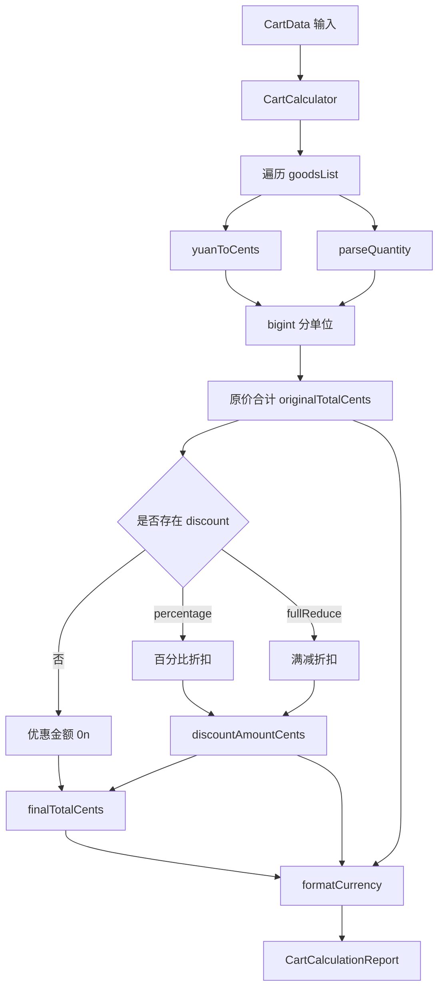
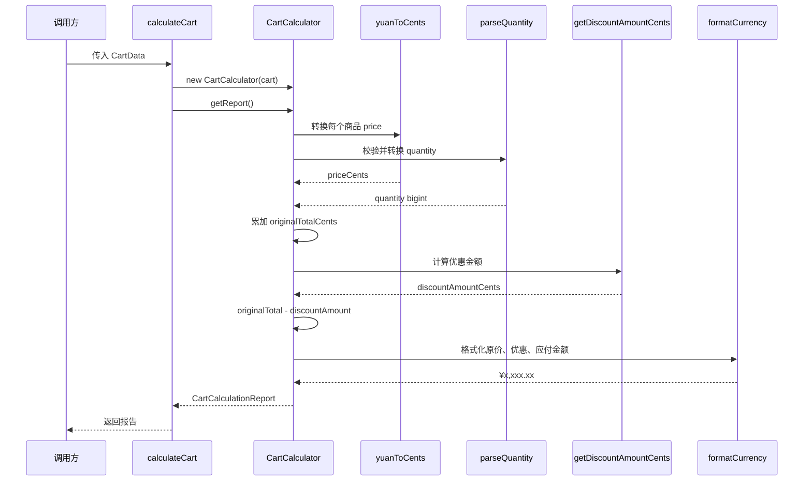

# JS 金融计算技术文档

## 1. 背景与目标

JS 金融计算项目位于 `packages/math`，用于演示购物车金额计算中如何规避 JavaScript 浮点数误差。项目对外提供金额转换、金额格式化、购物车总价计算、百分比折扣和满减折扣能力。

普通 `number` 在表达十进制小数时存在二进制浮点误差，例如 `0.1 + 0.2` 无法精确得到 `0.3`。在金融、订单、购物车等场景中，如果直接使用浮点数参与累加、折扣和格式化，可能导致金额误差进入最终结算结果。

本项目的核心目标如下：

- 金额输入按“元”表达，内部统一转换为“分”单位的 `bigint`。
- 所有金额累加、折扣、满减判断都基于整数完成。
- 金额输入最多支持两位小数，超出精度立即抛错。
- 折扣比例按万分比转换为整数，并对分以下结果执行四舍五入。
- 最终报告同时输出原始 `bigint` 金额和人民币格式化字符串。

## 2. 项目范围

| 路径                              | 说明                                              |
| --------------------------------- | ------------------------------------------------- |
| `packages/math/src/cart.ts`       | 购物车金额模型、金额转换、折扣计算、报告输出      |
| `packages/math/test/cart.test.ts` | Vitest 单元测试，覆盖精度、格式化、折扣和异常场景 |
| `packages/math/package.json`      | 包名称和测试脚本                                  |
| `packages/math/tsconfig.json`     | TypeScript 编译配置                               |

## 3. 设计原则

### 3.1 输入与内部表示分离

业务输入仍然使用用户更容易理解的“元”单位，例如 `19.99`。进入计算流程后，项目会立即转换为“分”单位的 `bigint`，例如 `19.99` 转换为 `1999n`。

这种设计有两个好处：

- 对外 API 保持直观，不要求调用方直接传入分单位。
- 内部计算完全基于整数，避免浮点误差在计算链路中传播。

### 3.2 先校验再计算

项目不会尝试自动修正非法金额，而是尽早抛错。金额精度、负数、科学计数法、非有限数、安全整数数量和非法折扣都会在进入核心计算前被拦截。

### 3.3 结果可审计

`CartCalculationReport` 同时提供分单位 `bigint` 和格式化金额，便于测试、日志、对账和页面展示使用。

## 4. 对外 API

### 4.1 类型定义

```ts
export interface Goods {
  id: number;
  price: number;
  quantity: number;
}

export interface PercentageDiscount {
  type: "percentage";
  value: number;
}

export interface FullReduceDiscount {
  type: "fullReduce";
  value: { threshold: number; reduce: number };
}

export type Discount = PercentageDiscount | FullReduceDiscount;

export interface CartData {
  goodsList: Goods[];
  discount?: Discount;
}
```

| 类型                 | 字段        | 说明                             |
| -------------------- | ----------- | -------------------------------- |
| `Goods`              | `id`        | 商品 ID，当前主要用于标识商品    |
| `Goods`              | `price`     | 商品单价，单位为元，最多两位小数 |
| `Goods`              | `quantity`  | 商品数量，必须是非负安全整数     |
| `PercentageDiscount` | `value`     | 折后比例，例如 `0.9` 表示九折    |
| `FullReduceDiscount` | `threshold` | 满减门槛，单位为元               |
| `FullReduceDiscount` | `reduce`    | 满减金额，单位为元               |

### 4.2 报告结构

```ts
export interface CartCalculationReport {
  originalTotalCents: bigint;
  originalTotalFormatted: string;
  discountAmountCents: bigint;
  discountAmountFormatted: string;
  finalTotalCents: bigint;
  finalTotalFormatted: string;
}
```

| 字段                      | 说明                     |
| ------------------------- | ------------------------ |
| `originalTotalCents`      | 折扣前总金额，单位为分   |
| `originalTotalFormatted`  | 折扣前总金额格式化结果   |
| `discountAmountCents`     | 优惠金额，单位为分       |
| `discountAmountFormatted` | 优惠金额格式化结果       |
| `finalTotalCents`         | 折扣后应付金额，单位为分 |
| `finalTotalFormatted`     | 折扣后应付金额格式化结果 |

### 4.3 函数与类

| API                                                         | 说明                                           |
| ----------------------------------------------------------- | ---------------------------------------------- |
| `yuanToCents(yuan)`                                         | 将元单位金额转换为分单位 `bigint`              |
| `formatCurrency(cents)`                                     | 将分单位 `bigint` 格式化为人民币金额字符串     |
| `new CartCalculator(cart)`                                  | 创建购物车计算器实例                           |
| `CartCalculator#getOriginalTotalCents()`                    | 计算折扣前总金额                               |
| `CartCalculator#getDiscountAmountCents(originalTotalCents)` | 基于原价计算优惠金额                           |
| `CartCalculator#getFinalTotalCents()`                       | 计算折扣后应付金额                             |
| `CartCalculator#getFormattedFinalTotal()`                   | 输出格式化后的应付金额                         |
| `CartCalculator#getReport()`                                | 输出完整计算报告                               |
| `calculateCart(cart)`                                       | 便捷函数，等价于创建计算器后调用 `getReport()` |

## 5. 总体架构



项目整体流程可以概括为：输入校验、整数化、整数计算、格式化输出。金额一旦进入内部计算流程，就不再使用浮点数参与加减乘除。

## 6. 金额转换

### 6.1 转换规则

`yuanToCents()` 通过 `parseScaledInteger(value, 2)` 将元转换为分。

转换步骤如下：

1. 调用 `normalizeDecimalString()` 将输入转换为字符串并执行基础校验。
2. 按小数点拆分整数部分和小数部分。
3. 如果小数部分超过两位，抛出 `Precision error`。
4. 将小数部分右侧补零到两位。
5. 拼接整数部分和补齐后的小数部分，并转换为 `BigInt`。

示例：

| 输入     | 字符串归一化 | 输出                   |
| -------- | ------------ | ---------------------- |
| `0.1`    | `0.10`       | `10n`                  |
| `19.99`  | `19.99`      | `1999n`                |
| `300`    | `300.00`     | `30000n`               |
| `19.991` | 超过两位小数 | 抛出 `Precision error` |

### 6.2 输入约束

`normalizeDecimalString()` 会拒绝以下输入：

| 场景                    | 错误信息           | 原因                           |
| ----------------------- | ------------------ | ------------------------------ |
| `Infinity`、`NaN`       | `Numeric overflow` | 非有限数不能参与金额计算       |
| 负数                    | `Invalid value`    | 当前购物车金额输入不接受负值   |
| 科学计数法，例如 `1e21` | `Numeric overflow` | 避免字符串展开和精度语义不明确 |
| 超过两位小数            | `Precision error`  | 金额单位固定到分               |

## 7. 数量校验

商品数量通过 `parseQuantity()` 转换为 `bigint`。

校验规则如下：

- 必须是安全整数，即满足 `Number.isSafeInteger(quantity)`。
- 必须大于或等于 `0`。
- 非法数量抛出 `Invalid quantity`。

数量转换为 `bigint` 后再与商品单价分值相乘，可以支持很大的订单金额，不会受到 `number` 安全整数上限的中间结果限制。

## 8. 折扣计算

### 8.1 无折扣

当 `cart.discount` 不存在时，优惠金额固定为 `0n`，最终金额等于原始总金额。

### 8.2 百分比折扣

百分比折扣使用 `discount.type === 'percentage'` 表示。`value` 表示折后比例，而不是优惠比例。

例如：

| value  | 含义   | 100 元最终金额 | 优惠金额 |
| ------ | ------ | -------------- | -------- |
| `1`    | 不打折 | `100.00`       | `0.00`   |
| `0.9`  | 九折   | `90.00`        | `10.00`  |
| `0.75` | 七五折 | `75.00`        | `25.00`  |

内部计算步骤如下：

```ts
const discountRate = parseScaledInteger(discount.value, 4);
const finalPrice = roundHalfUp(originalTotalCents * discountRate, 10_000n);
return originalTotalCents - finalPrice;
```

关键规则：

- 折扣比例最多支持四位小数。
- 折扣比例转换为万分比整数，例如 `0.9` 转换为 `9000n`。
- 折扣比例不能大于 `1`，即 `discountRate > 10000n` 时抛出 `Invalid discount`。
- 百分比折扣产生分以下结果时，最终价使用四舍五入。

四舍五入由 `roundHalfUp()` 实现：

```ts
const quotient = dividend / divisor;
const remainder = dividend % divisor;
return remainder * 2n >= divisor ? quotient + 1n : quotient;
```

### 8.3 满减折扣

满减折扣使用 `discount.type === 'fullReduce'` 表示。

内部计算步骤如下：

1. 将 `threshold` 转换为分单位 `thresholdCents`。
2. 将 `reduce` 转换为分单位 `reduceCents`。
3. 如果 `reduceCents > thresholdCents`，抛出 `Invalid discount`。
4. 如果原价总金额达到门槛，返回优惠金额。
5. 如果原价总金额未达到门槛，返回 `0n`。

为避免最终金额为负数，实际返回值会限制在原始总金额以内：

```ts
return reduceCents > originalTotalCents ? originalTotalCents : reduceCents;
```

在当前实现中，因为 `reduceCents` 不能大于 `thresholdCents`，且只有 `originalTotalCents >= thresholdCents` 时才触发满减，所以正常满减路径下不会出现优惠金额超过原价的情况。

## 9. 计算时序



## 10. 格式化输出

`formatCurrency(cents)` 接收分单位 `bigint`，输出人民币格式化字符串。

格式化规则如下：

- 输出以 `¥` 开头。
- 整数部分使用英文千分位分隔符。
- 小数部分固定两位。
- 支持负数格式化，负号位于 `¥` 之后。

示例：

| 输入            | 输出                |
| --------------- | ------------------- |
| `30n`           | `¥0.30`             |
| `12345678n`     | `¥123,456.78`       |
| `999900000000n` | `¥9,999,000,000.00` |
| `-123n`         | `¥-1.23`            |

## 11. 使用示例

### 11.1 无折扣购物车

```ts
import { calculateCart } from "@lark/math";

const report = calculateCart({
  goodsList: [{ id: 1, price: 19.99, quantity: 2 }],
});

console.log(report.finalTotalFormatted); // ¥39.98
```

### 11.2 百分比折扣

```ts
import { calculateCart } from "@lark/math";

const report = calculateCart({
  goodsList: [{ id: 6, price: 100, quantity: 1 }],
  discount: {
    type: "percentage",
    value: 0.9,
  },
});

console.log(report.discountAmountFormatted); // ¥10.00
console.log(report.finalTotalFormatted); // ¥90.00
```

### 11.3 满减折扣

```ts
import { calculateCart } from "@lark/math";

const report = calculateCart({
  goodsList: [{ id: 5, price: 350, quantity: 1 }],
  discount: {
    type: "fullReduce",
    value: { threshold: 300, reduce: 50 },
  },
});

console.log(report.discountAmountFormatted); // ¥50.00
console.log(report.finalTotalFormatted); // ¥300.00
```

## 12. 测试覆盖

`packages/math/test/cart.test.ts` 使用 Vitest 覆盖以下场景：

| 场景       | 覆盖点                                                     |
| ---------- | ---------------------------------------------------------- |
| 金额转换   | `0.1`、`19.99`、`99.99`、`300` 可正确转换为分              |
| 精度拒绝   | `0.30000000000000004`、`19.991` 抛出 `Precision error`     |
| 溢出拒绝   | `1e21` 抛出 `Numeric overflow`                             |
| 金额格式化 | 小金额、大金额和千分位格式化正确                           |
| 小数累加   | `0.1 * 3` 得到精确 `30n`                                   |
| 多商品累加 | 多商品分值相乘后累加正确                                   |
| 大数量计算 | 大数量订单金额使用 `bigint` 正确表示                       |
| 百分比折扣 | 九折场景正确计算优惠金额和最终金额                         |
| 分以下舍入 | 折扣计算产生分以下值时按四舍五入处理                       |
| 满减折扣   | 满 300 减 50 场景正确计算                                  |
| 非法数量   | 超过安全整数的数量抛出 `Invalid quantity`                  |
| 非法折扣   | 折扣比例大于 1 或满减金额大于门槛时抛出 `Invalid discount` |

## 13. 命令

### 13.1 运行 math 包测试

```bash
pnpm --filter @lark/math test
```

### 13.2 在包目录内运行

```bash
cd packages/math
pnpm test
```

## 14. 边界与注意事项

### 14.1 `number` 输入仍需谨慎

项目可以阻止明显的浮点误差进入金额转换，例如 `0.30000000000000004` 会因超过两位小数被拒绝。但调用方仍应避免先用浮点数完成业务计算后再传入本模块。

推荐做法：

- 商品价格来自数据库或接口时，应保证已经是两位小数以内的金额。
- 不要在调用前执行 `price * discount` 这类浮点计算。
- 折扣、满减和格式化应交给本模块统一处理。

### 14.2 当前不支持负金额

`yuanToCents()` 会拒绝负数。当前模型适用于普通购物车正向金额计算，不适用于退款、冲正、负向优惠等需要负金额的场景。

### 14.3 科学计数法被拒绝

`normalizeDecimalString()` 会拒绝包含 `e` 或 `E` 的字符串表达。这样可以避免极大值、极小值或隐式精度表达带来的歧义。

### 14.4 折扣语义是折后比例

百分比折扣的 `value` 表示最终应付比例，不是优惠比例。`0.9` 表示最终支付原价的 90%，优惠 10%。

### 14.5 满减规则较保守

当前满减要求 `reduce <= threshold`。这可以阻止明显不合理的折扣配置，但如果未来需要支持特殊营销活动，例如“满 1 减 5”，需要调整校验规则和业务语义。

## 15. 后续优化方向

- 增加对字符串金额输入的支持，避免调用方在创建 `number` 时已经产生精度问题。
- 增加 `quantity` 为零、小数数量、负数金额、负数数量等边界测试。
- 增加不同舍入策略配置，例如银行家舍入、向下取整或向上取整。
- 将错误信息定义为稳定错误码，便于业务层精确处理异常。
- 补充包入口导出配置，确保 `@lark/math` 在不同构建环境下可稳定引用。
