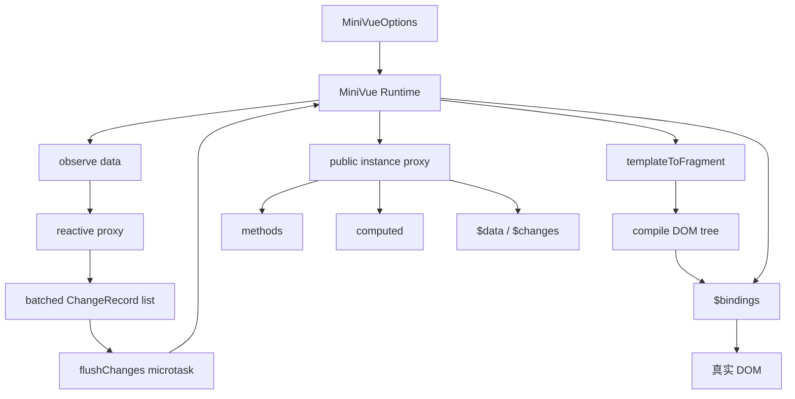
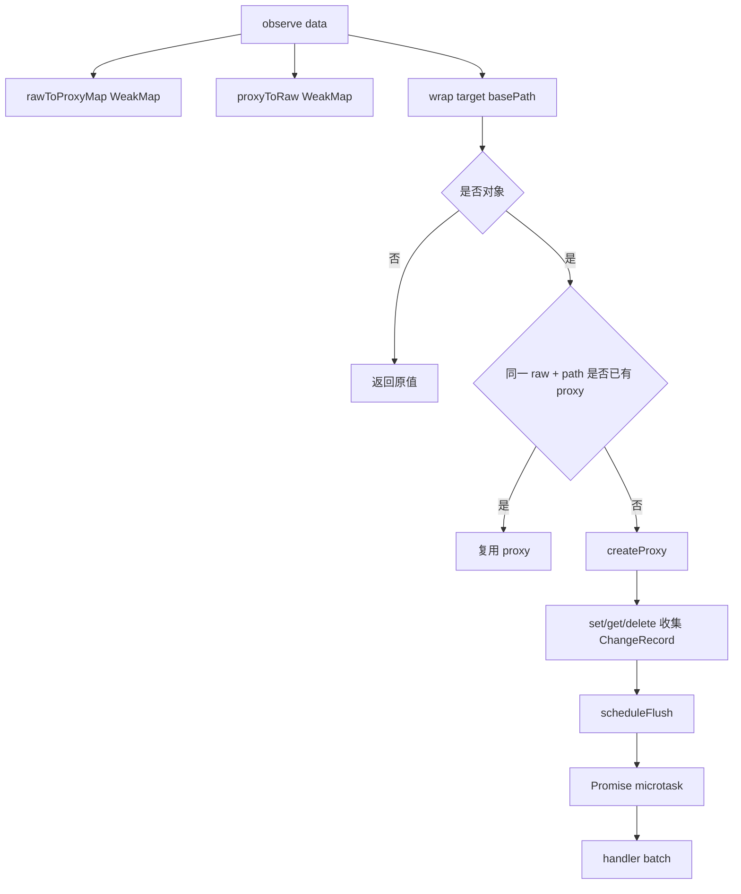
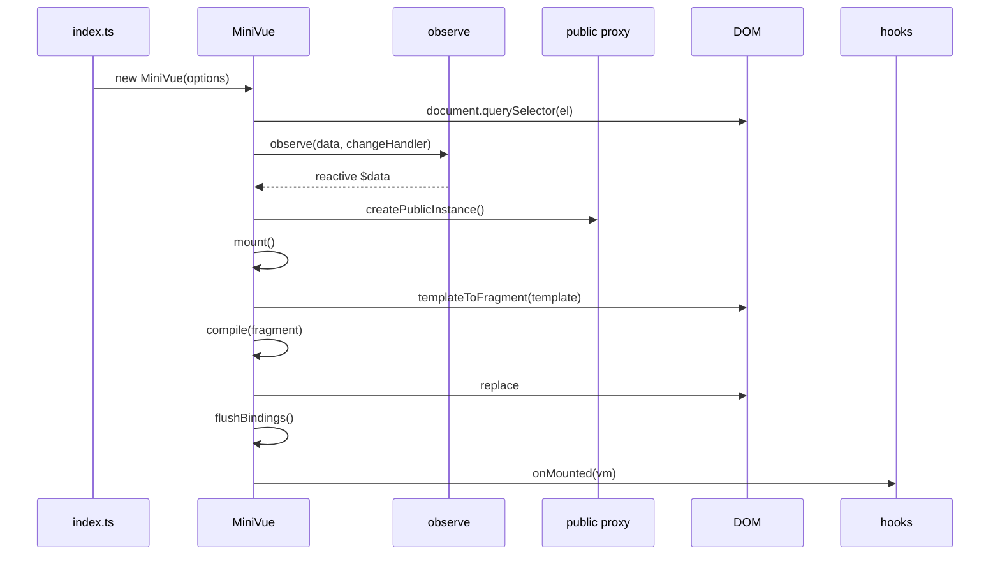
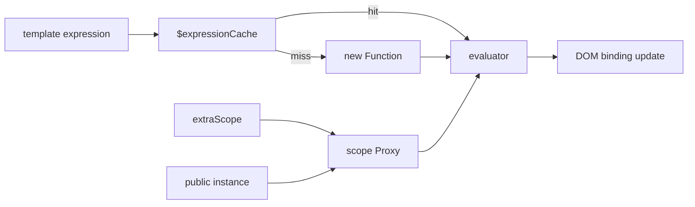
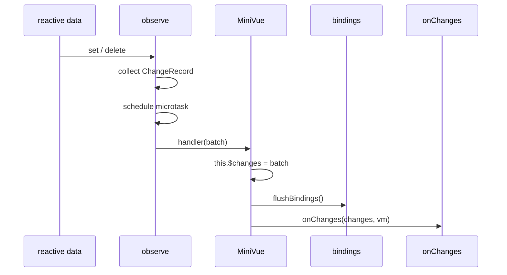
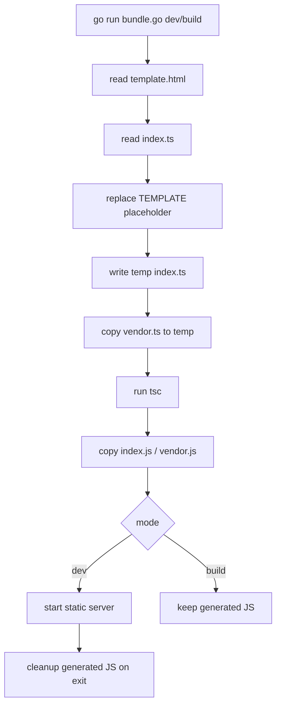

# Mini Vue 技术文档

## 1. 背景与目标

Mini Vue 项目位于 `packages/not-vue`，是一个用于演示 Vue 核心机制的小型运行时实验。它不依赖 Vue 源码，而是用 TypeScript 从 0 实现一套简化的响应式系统、模板编译器、公共实例代理、computed 求值和批量 DOM 更新流程。

项目通过一个购物车示例展示运行时能力：点击标题切换预览区域，点击图片修改标题，点击商品按钮向购物车添加商品，并实时展示购物车摘要和批量变更日志。

核心目标如下：

- 使用 `Proxy` 实现对象、数组和嵌套对象的响应式代理。
- 使用微任务合并多次状态变更，避免每次 `set` 都同步刷新 DOM。
- 支持模板插值、`v-if`、`v-html`、事件绑定和属性绑定。
- 使用公共实例代理统一访问 `data`、`methods`、`computed` 和内部字段。
- 通过 computed 生成购物车 HTML、摘要文本和变更日志。
- 使用轻量 Go 脚本完成模板注入、TypeScript 编译和本地预览。

## 2. 项目范围

| 路径                             | 说明                                                       |
| -------------------------------- | ---------------------------------------------------------- |
| `packages/not-vue/vendor.ts`     | MiniVue 运行时，实现响应式、模板编译、表达式求值和绑定刷新 |
| `packages/not-vue/index.ts`      | 购物车示例，定义状态、方法、computed 和 MiniVue 实例       |
| `packages/not-vue/template.html` | 示例模板，使用 MiniVue 支持的指令和插值语法                |
| `packages/not-vue/index.html`    | 浏览器入口 HTML，挂载 `#app` 并加载编译后的 `index.js`     |
| `packages/not-vue/bundle.go`     | 构建与开发脚本，负责模板注入、TS 编译和静态服务            |
| `packages/not-vue/vue.svg`       | 示例图片资源                                               |
| `packages/not-vue/react.svg`     | 示例图片资源                                               |
| `packages/not-vue/vite.svg`      | 示例图片资源                                               |

## 3. 能力概览

| 能力           | 支持情况 | 说明                                                   |
| -------------- | -------- | ------------------------------------------------------ |
| 响应式对象     | 支持     | 使用 `Proxy` 拦截 `get`、`set`、`deleteProperty`       |
| 嵌套对象响应式 | 支持     | 读取子对象时按路径懒代理                               |
| 数组变更追踪   | 支持     | 数组也是对象，`push`、索引赋值和 length 变化会触发代理 |
| 批处理更新     | 支持     | 通过 `Promise.resolve().then()` 合并变更               |
| 文本插值       | 支持     | 解析 `{{ expression }}`                                |
| 条件渲染       | 支持     | 支持 `v-if`，通过注释锚点插入或移除节点                |
| HTML 渲染      | 支持     | 支持 `v-html`，直接写入 `innerHTML`                    |
| 事件绑定       | 支持     | 支持 `@click` 和 `v-on:click`                          |
| 属性绑定       | 支持     | 支持 `:attr` 和 `v-bind:attr`                          |
| computed       | 支持     | 每次公共实例读取时同步计算，不做缓存                   |
| 生命周期       | 支持     | 支持 `onMounted` 和 `onChanges`                        |
| 虚拟 DOM       | 不支持   | 直接操作真实 DOM 和绑定函数                            |
| diff 算法      | 不支持   | 数据变化后执行所有绑定函数                             |
| 模板安全沙箱   | 不支持   | 表达式通过 `new Function` 和 `with` 执行               |

## 4. 总体架构



整体设计采用“编译一次，更新时重跑绑定函数”的模式。初始化时将模板编译为 DOM 片段，并为插值和指令生成绑定函数；数据变化后，运行时只需要执行 `$bindings` 中的函数即可刷新界面。

## 5. 响应式系统

### 5.1 变更记录模型

响应式层输出 `ChangeRecord`：

```ts
export interface ChangeRecord {
  type: "set" | "delete";
  target: object;
  key: PropertyKey;
  oldValue: unknown;
  newValue: unknown;
  path: string;
}
```

| 字段       | 说明                                              |
| ---------- | ------------------------------------------------- |
| `type`     | 变更类型，当前支持 `set` 和 `delete`              |
| `target`   | 被修改的原始对象                                  |
| `key`      | 被修改的属性键                                    |
| `oldValue` | 修改前的值                                        |
| `newValue` | 修改后的值，删除时为 `undefined`                  |
| `path`     | 从根状态到当前属性的访问路径，例如 `cart.0.count` |

`path` 是该实现的重要设计点。它让示例可以在变更日志中直接展示用户修改了哪一段状态，也便于后续排查嵌套对象和数组的变化来源。

### 5.2 createProxy

`createProxy()` 负责创建单个对象的代理。它拦截三类操作：

| 拦截器           | 行为                                                      |
| ---------------- | --------------------------------------------------------- |
| `get`            | 读取属性时，如果是对象，则通过 `__wrapChild` 懒创建子代理 |
| `set`            | 写入属性时记录旧值、新值和路径；值未变化时不触发通知      |
| `deleteProperty` | 删除已有属性时记录删除变更；删除不存在属性时直接返回成功  |

写入时会处理“把代理对象重新写回响应式对象”的情况：

```ts
const rawValue =
  isObject(value) && handler.__proxyToRaw?.has(value)
    ? handler.__proxyToRaw.get(value)
    : value;
```

这样可以避免代理套代理，保证内部保存的是原始对象。

### 5.3 observe

`observe()` 将普通对象转换为响应式对象，并负责批量派发变更。



内部使用两个缓存：

| 缓存            | 类型                                   | 作用                     |
| --------------- | -------------------------------------- | ------------------------ |
| `rawToProxyMap` | `WeakMap<object, Map<string, object>>` | 按原始对象和路径缓存代理 |
| `proxyToRaw`    | `WeakMap<object, object>`              | 从代理对象反查原始对象   |

`rawToProxyMap` 不是简单的 `WeakMap<object, object>`，而是 `WeakMap<object, Map<string, object>>`。这是因为同一个原始对象理论上可能出现在不同路径下，路径会影响 `ChangeRecord.path` 的生成，因此缓存需要同时考虑对象和路径。

### 5.4 批处理更新

响应式变更不会立即触发 UI 刷新，而是先写入 `changeList`，再通过微任务统一 flush：

```ts
const scheduleFlush = (): void => {
  if (scheduled) {
    return;
  }

  scheduled = true;
  Promise.resolve().then(flushChanges);
};
```

批处理效果：

- 同一个宏任务内多次状态修改只触发一次 `handler(batch)`。
- `handler` 收到完整的 `ChangeRecord[]`，可以用于刷新 DOM 和生成变更日志。
- 示例中的 `addToCart()` 同时修改 `count` 和 `lastAddedAt` 时，会在同一批变更中展示。

## 6. MiniVue 实例

### 6.1 初始化流程



初始化步骤：

1. 查找挂载元素 `options.el`。
2. 保存模板、方法、computed 和生命周期钩子。
3. 使用 `observe()` 创建响应式 `$data`。
4. 创建公共实例代理 `proxy`。
5. 将模板字符串转换为 `DocumentFragment`。
6. 编译文本节点和元素指令，生成绑定函数。
7. 清空挂载点并插入模板片段。
8. 首次执行 `flushBindings()` 渲染初始状态。
9. 执行 `onMounted` 钩子。

### 6.2 公共实例代理

`createPublicInstance()` 返回一个空对象代理，它决定模板表达式和方法中的 `this` 如何取值。

读取优先级如下：

```mermaid
flowchart TD
  A[读取 publicInstance.key] --> B{key 是否 $data}
  B -->|是| C[返回响应式 data]
  B -->|否| D{key 是否 $changes}
  D -->|是| E[返回当前批次变更]
  D -->|否| F{key 是否在 data 中}
  F -->|是| G[返回 data[key]]
  F -->|否| H{key 是否 computed}
  H -->|是| I[执行 computed getter]
  H -->|否| J{key 是否 method}
  J -->|是| K[返回 bind 后的方法]
  J -->|否| L[读取 MiniVue 实例字段]
```

写入规则：

- 如果写入 computed 字段，返回 `false`，禁止修改。
- 如果写入字符串 key，则默认写入 `$data`。
- 非字符串 key 走 `Reflect.set(this, key, value)`。

这使得方法内部可以像 Vue Options API 一样使用 `this.title = '...'`、`this.cart.push(...)`。

## 7. 模板编译

### 7.1 编译入口

`mount()` 调用 `templateToFragment()` 将模板字符串转为 DOM 片段，再递归调用 `compile()`：

```ts
private compile(node: Node): void {
  Array.from(node.childNodes).forEach((child) => {
    if (this.isTextNode(child)) {
      this.compileText(child);
    } else if (this.isElementNode(child)) {
      this.compileElement(child);
    }

    if (child.childNodes.length > 0) {
      this.compile(child);
    }
  });
}
```

编译阶段不立即求值所有表达式，而是为每个动态节点生成一个绑定函数，保存到 `$bindings`。数据更新时统一执行这些函数。

### 7.2 文本插值

文本节点支持 `{{ expression }}`：

```html
<p>{{ summaryText }}</p>
```

编译后生成绑定函数：

```ts
node.textContent = template.replace(/\{\{([\s\S]+?)\}\}/g, (_match, expr) =>
  this.toDisplayString(this.evaluate(expr.trim())),
);
```

一个文本节点中可以包含多个插值表达式。表达式结果为 `null` 或 `undefined` 时展示为空字符串；对象会被 `JSON.stringify()`。

### 7.3 v-if

`v-if` 使用注释节点作为锚点：

1. 在原节点前插入 `<!-- v-if:expr -->`。
2. 每次刷新时求值表达式。
3. 条件为真且节点不在 DOM 中，则插入到锚点后。
4. 条件为假且节点在 DOM 中，则移除节点。

该实现没有虚拟 DOM，也不复制节点。它复用同一个真实节点在 DOM 中插入或移除。

### 7.4 v-html

`v-html` 将表达式结果直接写入 `innerHTML`：

```html
<div v-html="cartHTML"></div>
```

示例中 `cartHTML` 和 `changeLogHTML` 都由 computed 生成 HTML 字符串。由于 `v-html` 不做安全过滤，业务内容必须先自行转义或确保可信。

### 7.5 事件绑定

支持两种事件写法：

```html
<button @click="addFirst">Add Product 1</button>
<button v-on:click="addSecond">Add Product 2</button>
```

绑定逻辑：

- 如果表达式正好是 methods 中的方法名，则直接调用该方法。
- 否则将表达式作为普通表达式求值，并注入 `$event`。

因此也支持类似写法：

```html
<button @click="addToCart(1)">Add</button>
```

### 7.6 属性绑定

支持两种属性绑定写法：

```html
 
```

表达式结果为 `false`、`null` 或 `undefined` 时，会移除目标属性；其他值会转为字符串写入属性。

## 8. 表达式求值

表达式通过 `evaluate()` 执行：

```ts
new Function("scope", `with (scope) { return (${expression}); }`);
```

求值上下文由 `extraScope` 和公共实例代理组成：

- `extraScope` 用于注入局部变量，例如事件处理中的 `$event`。
- 公共实例代理用于访问 `data`、`methods`、`computed` 和内部字段。
- 表达式函数会缓存到 `$expressionCache`，避免每次刷新都重新构造函数。



安全边界：表达式执行依赖 `new Function` 和 `with`，不适合运行不可信模板。该项目定位为运行时机制演示，而不是安全模板引擎。

## 9. computed 机制

computed 定义在 `options.computed`：

```ts
const appComputed = {
  cartHTML() {
    return this.cart.map(...).join('');
  },
  summaryText() {
    return `Total: ${totalCount} item(s), CNY ${totalPrice}`;
  },
  changeLogHTML() {
    return formatChangeLogHTML(this.$changes);
  },
};
```

当前实现的 computed 特点：

- 读取公共实例字段时同步执行 getter。
- getter 的 `this` 绑定为公共实例代理。
- 不做依赖收集，不做缓存，也没有脏值标记。
- 每次 `flushBindings()` 执行绑定函数时，相关 computed 都会重新计算。

这种设计牺牲了性能，但逻辑简单，适合用于教学和运行时机制展示。

## 10. 生命周期与变更钩子

MiniVue 支持两个钩子：

| 钩子        | 触发时机                  | 参数          |
| ----------- | ------------------------- | ------------- |
| `onMounted` | 模板挂载并首次刷新绑定后  | `vm`          |
| `onChanges` | 每次响应式批处理 flush 后 | `changes, vm` |

响应式变更后的流程：



示例中没有显式传入 `onChanges`，但 `changeLogHTML` computed 会读取 `$changes`，因此每次批处理后都会在界面中显示最新变更。

## 11. 购物车示例

### 11.1 状态结构

```ts
interface AppState {
  title: string;
  isActive: boolean;
  avatarUrl: string;
  avatarName: string;
  imageIndex: number;
  cart: CartItem[];
}
```

`CartItem` 包含 `id`、`name`、`price`、`count`、`meta.checked` 和 `lastAddedAt`。嵌套的 `meta` 和数组中的商品对象都会被响应式系统按需代理。

### 11.2 方法

| 方法                   | 行为                                                     |
| ---------------------- | -------------------------------------------------------- |
| `onTitleClick()`       | 切换 `isActive`，轮换图片，更新标题                      |
| `onImgClick()`         | 将标题改为包含当前时间的运行时标题                       |
| `addToCart(productId)` | 查找商品；已存在则增加数量并更新时间，否则向数组追加新项 |
| `addFirst()`           | 添加商品 1                                               |
| `addSecond()`          | 添加商品 2                                               |

### 11.3 computed

| computed        | 行为                                  |
| --------------- | ------------------------------------- |
| `cartHTML`      | 根据购物车数组生成商品列表 HTML       |
| `summaryText`   | 汇总商品数量和总价                    |
| `changeLogHTML` | 根据 `$changes` 生成批量变更日志 HTML |

### 11.4 模板能力覆盖

`template.html` 覆盖了主要运行时能力：

| 模板片段                                | 覆盖能力             |
| --------------------------------------- | -------------------- |
| `{{ title }}`                           | 文本插值             |
| `@click="onTitleClick"`                 | 方法事件绑定         |
| `v-if="isActive"`                       | 条件渲染             |
| `:src="avatarUrl"`、`:alt="title"`      | 属性绑定             |
| `{{ isActive ? 'visible' : 'hidden' }}` | 表达式求值           |
| `v-html="cartHTML"`                     | HTML 渲染            |
| `v-html="changeLogHTML"`                | computed + HTML 渲染 |

## 12. 构建与开发流程

项目没有单独的 `package.json`，构建逻辑集中在 `bundle.go` 中。Go 脚本完成以下工作：

1. 读取 `template.html`。
2. 读取 `index.ts` 和 `vendor.ts`。
3. 将 `index.ts` 中的 `<!-- TEMPLATE -->` 替换为模板内容。
4. 将生成后的 `index.ts` 和原始 `vendor.ts` 写入临时目录。
5. 调用 `tsc` 编译为 ESNext 模块。
6. 将编译后的 `index.js` 和 `vendor.js` 复制回 `packages/not-vue`。
7. 开发模式下启动静态文件服务器并在退出时清理生成文件。



### 12.1 开发命令

```bash
cd packages/not-vue
go run bundle.go dev
```

开发模式会在本地 3000 端口启动静态服务。服务退出时会删除生成的 `index.js` 和 `vendor.js`。

### 12.2 构建命令

```bash
cd packages/not-vue
go run bundle.go build
```

构建模式会保留生成的 `index.js` 和 `vendor.js`，便于直接通过 `index.html` 加载。

## 13. 与 Vue 的差异

| 维度     | MiniVue                        | Vue                                |
| -------- | ------------------------------ | ---------------------------------- |
| 响应式   | Proxy + 批处理变更回调         | Proxy + 精细依赖收集               |
| 更新粒度 | 每次批处理后执行全部绑定函数   | 依赖驱动组件或 effect 更新         |
| 模板编译 | 浏览器运行时遍历 DOM           | 编译为 render function             |
| DOM 更新 | 直接修改真实 DOM               | 虚拟 DOM / 编译优化 / patch        |
| computed | 每次读取都重新计算             | 依赖追踪、缓存和脏值标记           |
| 指令     | 仅支持少量演示指令             | 完整指令系统                       |
| 安全     | 使用 `new Function` 执行表达式 | 模板表达式受框架约束并有编译期处理 |
| 生态     | 教学实验                       | 生产级框架                         |

该项目的价值不在于完整复刻 Vue，而在于把 Vue 的几个关键机制拆成可以直接阅读和调试的小型实现。

## 14. 边界与注意事项

### 14.1 表达式执行不适合不可信模板

模板表达式使用 `new Function` 和 `with` 执行，可以访问公共实例代理暴露的能力。不应加载用户可编辑或第三方不可信模板。

### 14.2 v-html 需要自行保证内容安全

`v-html` 直接写入 `innerHTML`，不会做 XSS 过滤。示例中的 `changeLogHTML` 对变更内容做了 `escapeHTML()`，但其他业务内容需要自行处理。

### 14.3 computed 没有缓存

computed 每次读取都会执行 getter。对于轻量示例问题不大，但复杂计算或大量绑定会带来性能开销。

### 14.4 更新没有依赖收集

任何响应式变更都会执行全部绑定函数。该策略简单可靠，但不适合大型 DOM 或高频更新场景。

### 14.5 条件渲染复用真实节点

`v-if` 通过注释锚点插入或移除同一个真实节点。该实现没有处理复杂的相邻分支、嵌套组件生命周期或过渡动画。

### 14.6 构建链路依赖本地 TypeScript 编译器

`bundle.go` 会优先查找本地 `tsc`，找不到时使用 `npx tsc`。离线环境或缺少 Node 依赖时可能无法完成编译。

## 15. 后续优化方向

- 引入依赖收集和 effect 模型，让绑定函数只在相关数据变化时执行。
- 为 computed 增加缓存、依赖追踪和脏值标记。
- 增加 `v-model`、`v-for`、class / style 对象绑定等常见指令。
- 将模板编译为 render function，减少运行时 DOM 遍历和字符串表达式求值。
- 增加单元测试，覆盖响应式代理、批处理、模板编译和表达式求值。
- 提供模板安全策略或限制表达式能力，避免不可信模板执行任意代码。
- 将 Go 构建脚本和根工程脚本打通，提供统一的 npm / pnpm 命令入口。
