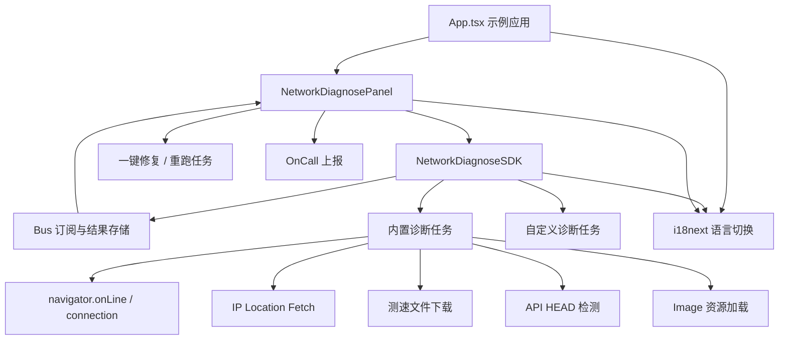
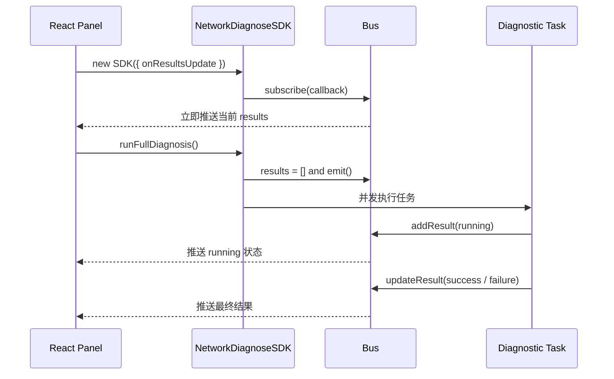
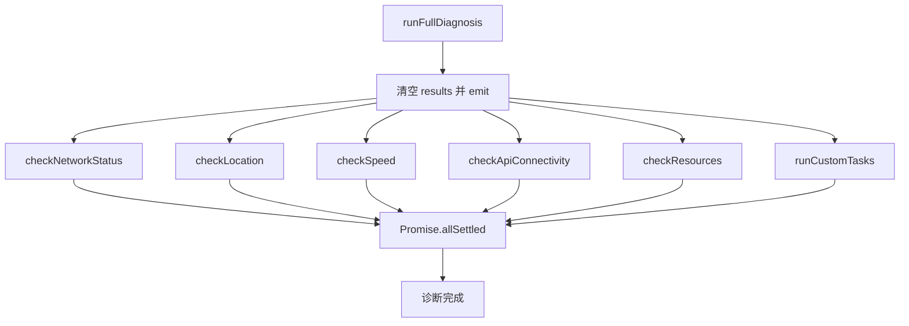
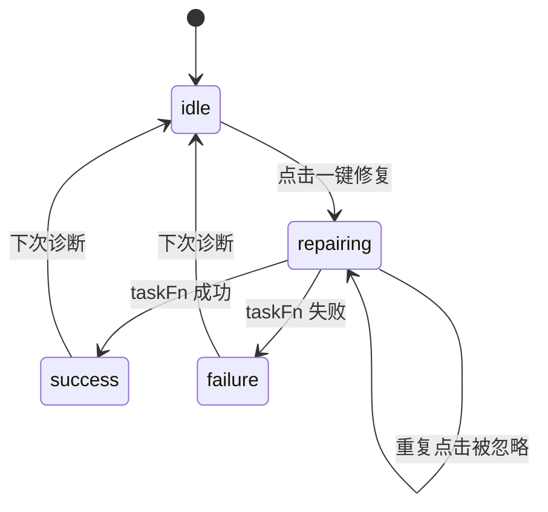
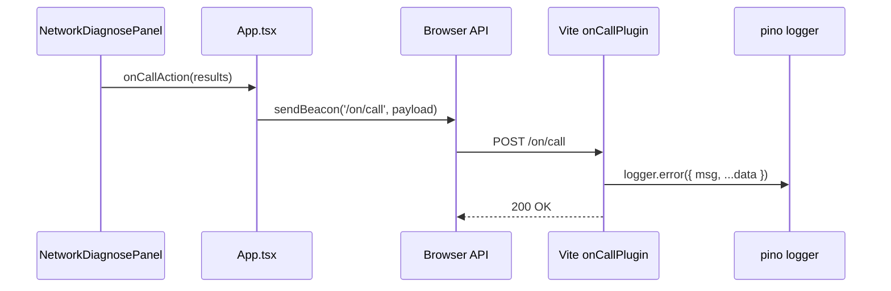

# 网络检测工具技术文档

## 1. 背景与目标

网络检测工具位于 `packages/network`，由浏览器端诊断 SDK 和 React 展示面板组成。它用于在 Web 应用中快速采集用户侧网络状态、地理位置、下载速度、接口连通性和静态资源可用性，并将诊断结果以浮窗面板形式展示给用户或支持人员。

该项目的核心目标如下：

- 在前端运行时完成网络诊断，不依赖后端诊断服务。
- 通过 SDK 统一封装诊断任务、状态更新、订阅通知和修复动作。
- 通过 React 面板展示诊断进度、结果明细、失败建议和修复入口。
- 支持业务侧配置 API 列表、资源列表、测速文件和自定义诊断任务。
- 支持中英文国际化，便于在不同语言环境中展示诊断文案。
- 支持失败后触发 OnCall 上报，将诊断结果提交给外部处理链路。

## 2. 项目范围

| 路径                                                         | 说明                                                 |
| ------------------------------------------------------------ | ---------------------------------------------------- |
| `packages/network/src/sdk/network-diagnose-sdk.ts`           | 诊断 SDK，实现任务执行、结果存储、订阅通知和修复动作 |
| `packages/network/src/sdk/types.ts`                          | SDK 类型定义、任务 ID、结果结构和配置结构            |
| `packages/network/src/components/network-diagnose-panel.tsx` | React 诊断面板，展示结果并触发诊断、修复和 OnCall    |
| `packages/network/src/App.tsx`                               | 示例应用，提供诊断配置、语言切换和 OnCall 上报逻辑   |
| `packages/network/src/i18n.ts`                               | i18next 初始化                                       |
| `packages/network/src/locales`                               | 中英文文案                                           |
| `packages/network/vite.config.ts`                            | Vite、React、TailwindCSS 和 OnCall 开发插件配置      |
| `packages/network/src/index.css`                             | TailwindCSS、DaisyUI 主题和全局字体配置              |

## 3. 技术栈

| 技术                    | 用途                             |
| ----------------------- | -------------------------------- |
| React 19                | 诊断面板和示例应用 UI            |
| Vite                    | 开发服务器和生产构建             |
| TypeScript              | SDK 和 UI 类型约束               |
| TailwindCSS             | 样式体系                         |
| DaisyUI                 | 按钮、卡片、徽标、弹窗等 UI 类名 |
| i18next / react-i18next | 国际化文案管理                   |
| lucide-react            | 状态、操作和提示图标             |
| pino / pino-pretty      | 开发环境 OnCall 请求日志         |

## 4. 总体架构



项目采用“SDK 负责诊断、UI 负责展示”的分层设计。SDK 不依赖 React，只通过订阅回调推送 `DiagnosticResult[]`；React 面板订阅 SDK 结果并根据任务 ID 渲染不同的明细内容。

## 5. 核心数据模型

### 5.1 诊断任务 ID

内置任务 ID 定义在 `DiagnosticTaskId`：

```ts
export enum DiagnosticTaskId {
  NetworkStatus = "network-status",
  LocationCheck = "location-check",
  SpeedTest = "speed-test",
  ApiCheck = "api-check",
  ResourceCheck = "resource-check",
}
```

| ID               | 任务                    |
| ---------------- | ----------------------- |
| `network-status` | 浏览器网络状态检测      |
| `location-check` | IP、地理位置和 ISP 检测 |
| `speed-test`     | 下载速度和延迟测试      |
| `api-check`      | API 连通性检测          |
| `resource-check` | 静态资源加载检测        |

### 5.2 诊断结果

```ts
export interface DiagnosticResult {
  id: string;
  name: string;
  status: "pending" | "running" | "success" | "failure" | "skipped";
  message?: string;
  details?: unknown;
  error?: string;
  duration?: number;
  recommendation?: string;
  repairStatus?: "idle" | "repairing" | "success" | "failure";
  repair?: () => Promise<boolean>;
}
```

| 字段             | 说明                                       |
| ---------------- | ------------------------------------------ |
| `id`             | 任务唯一标识，用于更新结果和 UI 分类型渲染 |
| `name`           | 本地化后的任务名称                         |
| `status`         | 当前任务状态                               |
| `message`        | 面向用户的结果摘要                         |
| `details`        | 任务明细，不同任务结构不同                 |
| `error`          | 失败原因                                   |
| `duration`       | 任务耗时，单位毫秒                         |
| `recommendation` | 修复建议                                   |
| `repairStatus`   | 修复动作状态                               |
| `repair`         | 可选的一键修复函数                         |

### 5.3 SDK 配置

```ts
export interface SDKOptions {
  lang?: "en" | "zh";
  apiList?: string[];
  resourceList?: string[];
  speedTestFileUrl?: string;
  customTasks?: CustomTask[];
  onResultsUpdate?: DiagnosticCallback;
  updateResult?: (id: string, updates: Partial<DiagnosticResult>) => void;
}
```

| 配置               | 说明                                      |
| ------------------ | ----------------------------------------- |
| `lang`             | 诊断结果文案语言，默认为 `en`             |
| `apiList`          | 需要检测连通性的 API URL 列表             |
| `resourceList`     | 需要检测加载状态的图片或静态资源 URL 列表 |
| `speedTestFileUrl` | 自定义测速文件 URL                        |
| `customTasks`      | 业务自定义诊断任务                        |
| `onResultsUpdate`  | 结果变化回调                              |
| `updateResult`     | SDK 注入给自定义任务的内部更新函数        |

## 6. 订阅机制

SDK 内部的 `Bus` 类负责保存结果和通知订阅者。



关键行为：

- `subscribe()` 会立即向新订阅者推送当前结果，保证 UI 初始化时状态一致。
- `addResult()` 按 `id` 去重，已有结果会被替换，不存在则追加。
- `updateResult()` 会合并局部字段并触发通知。
- `emit()` 会传递新数组 `[...]`，确保 React `useState` 能触发重新渲染。

## 7. 诊断执行流程

`runFullDiagnosis()` 是完整诊断入口。

```ts
public async runFullDiagnosis() {
  this.results = [];
  this.emit();

  const tasks = [
    this.checkNetworkStatus(),
    this.checkLocation(),
    this.checkSpeed(),
    this.checkApiConnectivity(),
    this.checkResources(),
    ...this.runCustomTasks(),
  ];

  await Promise.allSettled(tasks);
}
```

执行特点：

- 每次完整诊断前会清空历史结果。
- 内置任务和自定义任务并发执行。
- 使用 `Promise.allSettled()` 等待所有任务结束，单个任务失败不会中断整体诊断。
- 每个任务通过 `addResult()` 和 `updateResult()` 向 UI 推送进度和最终状态。



## 8. 内置诊断任务

### 8.1 网络状态检测

`checkNetworkStatus()` 读取浏览器网络 API：

- `navigator.onLine`：判断浏览器是否在线。
- `navigator.connection.effectiveType`：网络类型，例如 `4g`。
- `navigator.connection.downlink`：估算下载带宽。
- `navigator.connection.rtt`：估算往返延迟。
- `navigator.connection.saveData`：是否启用流量节省模式。

如果浏览器报告离线，会将任务置为 `failure`，并提供修复建议和重跑修复函数。

SDK 还会监听网络变化：

```ts
window.addEventListener("online", () => handleConnectionChange());
window.addEventListener("offline", () => handleConnectionChange());
navigator.connection?.addEventListener("change", handleConnectionChange);
```

当已有网络状态结果时，网络变化会自动重跑网络状态检测。

### 8.2 地理位置与 ISP 检测

`checkLocation()` 通过公网 IP 信息接口获取：

- IP 地址。
- 城市。
- 地区。
- 国家。
- ISP 或组织信息。

该任务使用 `AbortController` 设置 5 秒超时。请求失败时会标记为 `failure`，但文案明确说明核心功能不受影响。

### 8.3 下载速度测试

`checkSpeed()` 下载测试文件并计算速度：

1. 选择 `speedTestFileUrl`，未配置时使用默认测试图片。
2. 通过 `fetch()` 发起请求，并添加时间戳避免缓存。
3. 使用 `cache: 'no-store'` 避免读取或写入缓存。
4. 将响应转为 `blob`，根据文件大小和耗时计算 Mbps。
5. 记录下载速度和延迟。

计算公式：

```ts
const sizeInBits = blob.size * 8;
const durationInSeconds = (endTime - startTime) / 1000;
const bps = sizeInBits / durationInSeconds;
const mbps = bps / (1024 * 1024);
```

该任务使用 10 秒超时，失败时提供切换网络环境的建议。

### 8.4 API 连通性检测

`checkApiConnectivity()` 针对 `apiList` 逐项发起 `HEAD` 请求：

```ts
fetch(url, {
  method: "HEAD",
  mode: "no-cors",
  cache: "no-store",
});
```

结果字段包括：

| 字段     | 说明                                    |
| -------- | --------------------------------------- |
| `url`    | 被检测接口                              |
| `status` | HTTP 状态码；跨域 opaque 响应可能不可读 |
| `ok`     | 是否认为可达                            |
| `timeMs` | 请求耗时                                |

由于使用 `mode: 'no-cors'`，跨域 opaque 响应无法读取状态码和响应体，SDK 会将 `res.type === 'opaque'` 视为可达。

如果未配置 `apiList`，该任务状态为 `skipped`。

### 8.5 静态资源加载检测

`checkResources()` 针对 `resourceList` 创建内存中的 `Image` 对象检测加载状态：

- `img.onload` 表示资源加载成功。
- `img.onerror` 表示资源加载失败。
- URL 追加时间戳避免缓存影响。

该方式适合检测图片、favicon、CDN 静态资源等可由图片加载器拉取的资源。如果未配置 `resourceList`，任务状态为 `skipped`。

## 9. 自定义任务

业务方可以通过 `customTasks` 扩展诊断能力。

```ts
export interface CustomTask {
  id: string;
  name: string;
  run: (ctx: SDKOptions) => Promise<unknown>;
  repair?: (ctx: SDKOptions) => Promise<boolean>;
}
```

自定义任务执行规则：

- 任务开始时先写入 `running` 状态。
- `run(ctx)` 成功后写入 `success`、`details` 和 `duration`。
- `run(ctx)` 抛错后写入 `failure`、`error` 和 `duration`。
- 如果提供 `repair(ctx)`，失败结果会展示一键修复按钮。
- 修复成功后会重新执行 `run(ctx)`，并刷新任务结果。

`ctx` 中包含 SDK 配置和 `updateResult()`，自定义任务可以在长任务中主动更新中间状态。

## 10. 修复动作

内置任务和自定义任务都可以提供修复函数。SDK 通过 `createRepairFn()` 包装内置重跑逻辑，避免重复点击导致并发修复。



内置任务的修复动作本质上是重跑当前检测任务；自定义任务可以实现真正的业务修复逻辑，例如刷新 token、切换备用域名、重新初始化 SDK 等。

## 11. React 面板

`NetworkDiagnosePanel` 是右下角浮窗组件。

### 11.1 组件入参

```ts
interface NetworkDiagnosePanelProps {
  config: Omit<SDKOptions, "onResultsUpdate">;
  title?: string;
  onCallAction?: (results: DiagnosticResult[]) => void;
}
```

| 入参           | 说明                                               |
| -------------- | -------------------------------------------------- |
| `config`       | SDK 配置，不包含 `onResultsUpdate`，由组件内部注入 |
| `title`        | 面板标题，默认 `Network Diagnostics`               |
| `onCallAction` | 失败后触发的外部上报函数                           |

### 11.2 状态管理

组件内部维护：

| 状态        | 说明                                  |
| ----------- | ------------------------------------- |
| `isOpen`    | 是否展开浮窗                          |
| `results`   | 当前诊断结果列表                      |
| `isRunning` | 是否正在执行完整诊断                  |
| `sessionId` | 页面内诊断 ID，用于人工排查时关联日志 |
| `showToast` | 未配置 OnCall 时的提示状态            |

SDK 通过 `useMemo()` 创建，并将 `onResultsUpdate` 注入为 `setResults(newResults)`。语言变化时，SDK 会根据当前 `i18n.language` 重新创建。

### 11.3 展示逻辑

面板根据 `DiagnosticResult.status` 展示不同图标：

| 状态      | UI 表现         |
| --------- | --------------- |
| `success` | 成功图标        |
| `failure` | 失败图标        |
| `running` | loading spinner |
| `skipped` | 跳过图标        |
| 其他      | 等待图标        |

面板根据任务 ID 渲染不同明细：

- 网络状态：在线状态、网络类型、下载带宽、RTT、流量节省模式。
- 地理位置：IP、城市、地区、国家、ISP。
- 测速：下载速度和延迟。
- API 连通性：URL、状态、耗时。
- 静态资源：URL、加载结果、耗时。
- 自定义任务：默认展示 JSON 字符串。

失败任务会展示 `recommendation`，并在存在 `repair` 时展示“一键修复”按钮。

## 12. OnCall 上报

示例应用在 `App.tsx` 中提供 `handleOnCall()`：

```ts
const payload = JSON.stringify({
  timestamp: new Date().toISOString(),
  userAgent: navigator.userAgent,
  language: i18n.language,
  results,
});
```

上报逻辑：

- 优先使用 `navigator.sendBeacon('/on/call', payload)`。
- 不支持 `sendBeacon` 时回退到 `fetch('/on/call', { method: 'POST', keepalive: true })`。
- Vite 开发插件在 `/on/call` 接收 POST 请求，并用 pino 打印结构化日志。



生产环境中，`/on/call` 应替换为真实告警、工单或日志采集接口。

## 13. 国际化

项目使用 i18next 管理中英文文案：

- 默认语言为中文 `zh`。
- 兜底语言为英文 `en`。
- React 文案通过 `useTranslation()` 获取。
- SDK 文案通过 `i18n.t(key, { lng })` 获取。

语言切换发生在 `App.tsx` 中：

```ts
const handleLanguageChange = (lang: string) => {
  i18n.changeLanguage(lang);
};
```

面板根据当前语言重新创建 SDK，使后续诊断任务使用新语言。已有诊断结果不会被主动重新翻译，通常需要重新运行诊断以刷新文案。

## 14. 示例配置

`App.tsx` 提供了示例配置：

```ts
const diagnosticConfig = {
  apiList: [
    "api.github.com",
    "jsonplaceholder.typicode.com/todos/1",
    "httpbin.org/get",
  ],
  resourceList: [
    "vitejs.dev/logo.svg",
    "react.dev/favicon.ico",
    "www.google.com/favicon.ico",
  ],
  speedTestFileUrl: "upload.wikimedia.org/.../LARGE_elevation.jpg",
};
```

文档中省略了协议前缀，实际代码使用完整 URL。

配置建议：

- `apiList` 应选择业务关键 API、网关健康检查接口或低副作用接口。
- `resourceList` 应选择首屏关键静态资源、CDN 资源或 favicon 等轻量资源。
- `speedTestFileUrl` 应选择稳定、大小适中、允许跨域下载的静态文件。
- 自定义任务应避免长时间阻塞，并尽量设置超时。

## 15. 构建与运行

```bash
pnpm --filter @lark/network dev
pnpm --filter @lark/network build
pnpm --filter @lark/network preview
pnpm --filter @lark/network lint
pnpm --filter @lark/network format
```

| 命令      | 说明                                   |
| --------- | -------------------------------------- |
| `dev`     | 启动 Vite 开发服务器                   |
| `build`   | 执行 TypeScript 构建检查并打包生产资源 |
| `preview` | 预览生产构建产物                       |
| `lint`    | 执行 ESLint 检查                       |
| `format`  | 执行 Prettier 格式化                   |

## 16. 边界与注意事项

### 16.1 浏览器 API 兼容性

`navigator.connection` 并非所有浏览器都完整支持。SDK 使用可选链读取字段，缺失时展示未知值，不会阻断诊断流程。

### 16.2 外部检测依赖稳定性

地理位置、测速、API 和资源检测都依赖外部 URL。外部服务限流、跨域策略、DNS 污染、缓存策略或网络屏蔽都会影响结果。诊断结果应作为排障线索，而不是唯一判定依据。

### 16.3 `no-cors` 的结果限制

API 连通性检测使用 `mode: 'no-cors'` 规避跨域阻断，但浏览器会返回 opaque 响应，JavaScript 无法读取真实状态码和响应体。因此该任务更适合判断“请求是否能发出并得到浏览器层面的响应”，不适合判断业务接口语义是否正确。

### 16.4 测速结果不是严格带宽测试

下载速度由单个测试文件的下载耗时估算，受文件大小、CDN、浏览器调度、缓存、跨域和当前网络波动影响。它适合做粗略用户侧体验判断，不等同于专业测速工具。

### 16.5 修复动作默认是重跑检测

内置任务的一键修复本质上是重跑当前任务，并不能真正修改用户网络环境。业务方如需真正修复，应通过自定义任务提供具体 repair 逻辑。

### 16.6 OnCall 接口仅为开发示例

Vite 插件中的 `/on/call` 只在开发服务器中生效，生产环境需要接入真实上报服务。

## 17. 后续优化方向

- 为每个内置任务增加可配置超时时间。
- 为 API 检测提供 `GET`、`POST`、自定义 header 和期望状态码配置。
- 为资源检测增加非图片资源检测方式，例如 `fetch`、`link preload` 或 `performance` 数据采集。
- 增加诊断结果导出能力，便于用户复制给支持团队。
- 增加 SDK 单元测试，覆盖订阅、任务状态更新、修复动作和自定义任务。
- 增加浏览器兼容性降级策略说明。
- 将 OnCall 上报抽象为可配置 adapter，支持日志平台、工单系统或告警系统。
