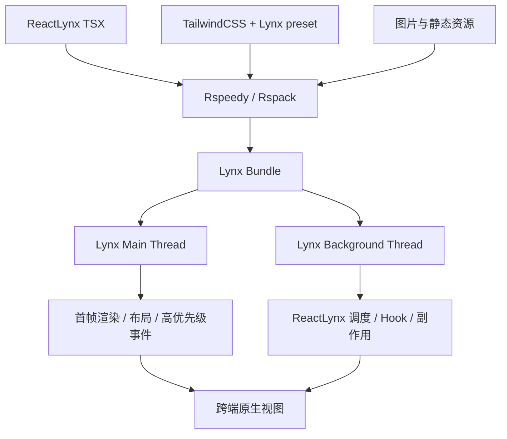
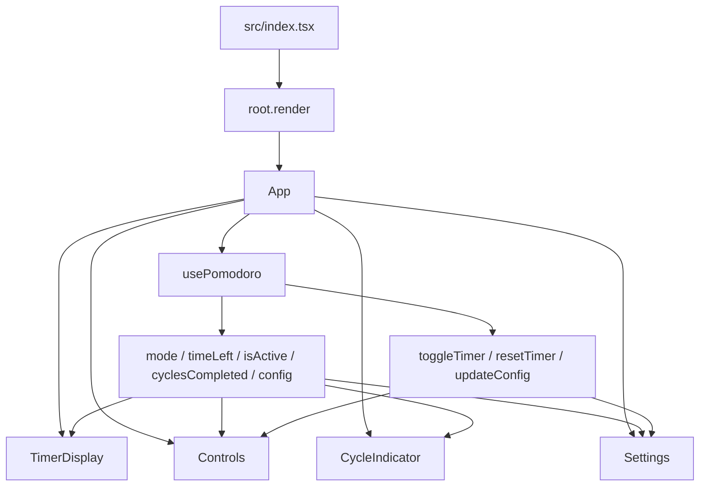
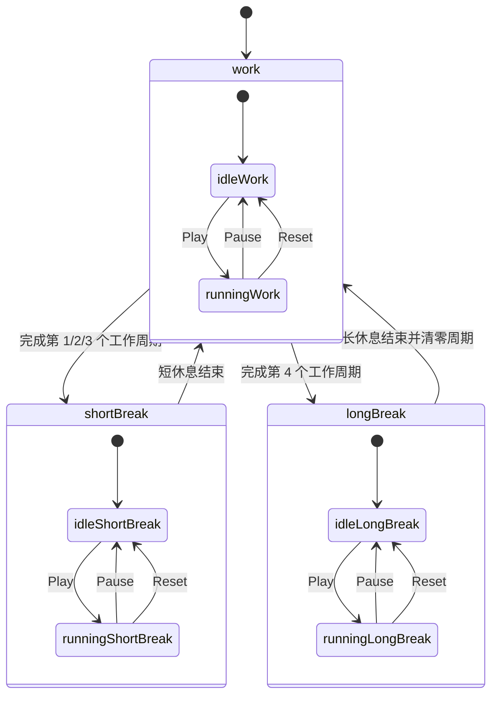
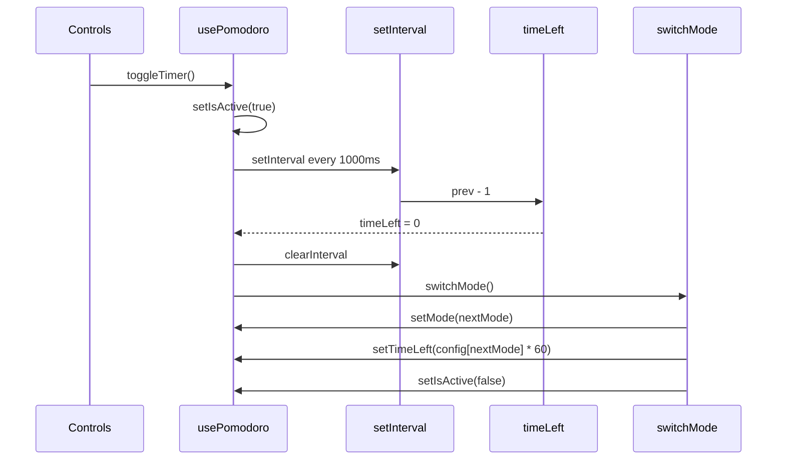
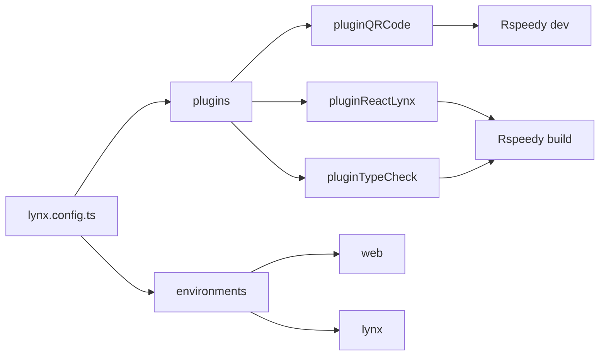
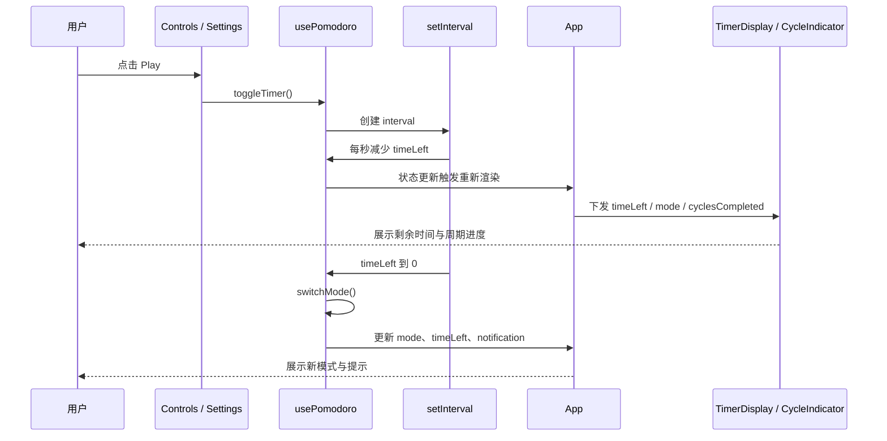

# 番茄钟技术文档

## 1. 背景与目标

番茄钟项目位于 `packages/pomodoro`，是一个基于 ReactLynx、Lynx、Rspeedy 和 TailwindCSS 的跨端计时应用。项目以番茄工作法为业务场景，验证 React 组件模型在 Lynx 元件体系中的开发方式，以及 Rspeedy 在 Web 与 Lynx 双环境中的构建、预览和调试链路。

应用默认配置为：工作 25 分钟、短休息 5 分钟、长休息 15 分钟。每完成 4 个工作周期后进入一次长休息，长休息结束后重新开始周期计数。

核心目标如下：

- 使用 React Hook 管理番茄钟计时状态、周期切换和配置更新。
- 使用 ReactLynx 的 `view`、`text` 元件构建跨端 UI，而不是依赖浏览器 DOM。
- 使用 Lynx 事件属性 `bindtap` 处理点击交互。
- 使用 Rspeedy 同时支持 Web 预览和 Lynx Bundle 构建。
- 使用 TailwindCSS 与 Lynx preset 编写跨端样式。
- 通过一个小型应用理解 Lynx 双线程架构、IFR 首帧策略和移动端渲染约束。

## 2. 项目范围

| 路径                                                         | 说明                                                     |
| ------------------------------------------------------------ | -------------------------------------------------------- |
| `packages/pomodoro/src/index.tsx`                            | ReactLynx 应用入口，调用 `root.render(<App />)`          |
| `packages/pomodoro/src/App.tsx`                              | 应用布局入口，组装计时展示、控制区、周期指示器和设置弹窗 |
| `packages/pomodoro/src/hooks/use-pomodoro.ts`                | 番茄钟核心状态 Hook                                      |
| `packages/pomodoro/src/components/timer-display/index.tsx`   | 计时盘和当前模式展示                                     |
| `packages/pomodoro/src/components/controls/index.tsx`        | 开始、暂停、重置控制区                                   |
| `packages/pomodoro/src/components/cycle-indicator/index.tsx` | 4 个番茄周期进度展示                                     |
| `packages/pomodoro/src/components/settings/index.tsx`        | 工作、短休息、长休息时长配置弹窗                         |
| `packages/pomodoro/src/types/index.ts`                       | 计时模式、配置和状态类型                                 |
| `packages/pomodoro/src/utils/time.ts`                        | 秒数格式化工具                                           |
| `packages/pomodoro/lynx.config.ts`                           | Rspeedy、ReactLynx、二维码和类型检查插件配置             |
| `packages/pomodoro/tailwind.config.js`                       | TailwindCSS 内容扫描和 Lynx preset 配置                  |
| `packages/pomodoro/postcss.config.js`                        | PostCSS 中启用 TailwindCSS                               |
| `packages/pomodoro/biome.json`                               | Biome 格式化和 lint 配置                                 |
| `packages/pomodoro/README.md`                                | 项目背景和 Lynx 双线程架构说明                           |

## 3. 技术栈

| 技术                             | 用途                                                         |
| -------------------------------- | ------------------------------------------------------------ |
| ReactLynx `@lynx-js/react`       | 使用 React 风格开发 Lynx UI                                  |
| Lynx                             | 跨端渲染引擎，输出 iOS、Android、HarmonyOS、Web 可运行的视图 |
| Rspeedy                          | 基于 Rspack / Rsbuild 的 Lynx 构建工具                       |
| `@lynx-js/react-rsbuild-plugin`  | 将 ReactLynx 接入 Rspeedy 构建流程                           |
| `@lynx-js/qrcode-rsbuild-plugin` | 开发时输出扫码调试入口                                       |
| `@rsbuild/plugin-type-check`     | 构建阶段类型检查                                             |
| TailwindCSS                      | 原子化样式编写                                               |
| `@lynx-js/tailwind-preset`       | 适配 Lynx 样式能力的 Tailwind preset                         |
| Biome                            | 代码格式化和 lint                                            |
| TypeScript                       | 类型约束和工程配置                                           |

## 4. Lynx 背景

Lynx 是以 Web 技术为语义参照的跨端渲染引擎，一套代码可以覆盖移动端和 Web。它与传统 Web 的核心差异在于：

- 没有浏览器 DOM，UI 由 Lynx 元件树描述。
- 使用 `view`、`text` 等内置元件映射到宿主平台原生视图。
- ReactLynx 的生命周期和副作用主要运行在后台线程。
- 主线程负责首屏渲染、布局和主线程脚本等高优先级工作。
- 通过 IFR 即时首帧渲染降低白屏风险。
- Rspeedy 负责编译 TypeScript、TSX、CSS 和资源，并输出 Lynx Bundle。



该番茄钟项目没有直接使用 DOM API、`window` 或 `document`，UI 全部使用 Lynx 元件和 ReactLynx 组件表达，符合 Lynx 的跨端约束。

## 5. 总体架构



架构分层如下：

- 状态层：`usePomodoro` 负责计时、模式切换、周期计数和配置更新。
- 展示层：`TimerDisplay`、`CycleIndicator` 根据状态渲染 UI。
- 交互层：`Controls`、`Settings` 通过 `bindtap` 触发 Hook 暴露的动作。
- 工程层：Rspeedy、ReactLynx 插件、Tailwind preset 和 Biome 提供开发构建能力。

## 6. 业务状态模型

### 6.1 类型定义

```ts
export type TimerMode = "work" | "shortBreak" | "longBreak";

export interface TimerConfig {
  work: number;
  shortBreak: number;
  longBreak: number;
}

export interface PomodoroState {
  mode: TimerMode;
  timeLeft: number;
  isActive: boolean;
  cyclesCompleted: number;
}
```

| 字段              | 说明                               |
| ----------------- | ---------------------------------- |
| `mode`            | 当前计时模式：工作、短休息或长休息 |
| `timeLeft`        | 当前模式剩余秒数                   |
| `isActive`        | 计时器是否正在运行                 |
| `cyclesCompleted` | 当前长休息周期内已完成的工作轮数   |
| `config`          | 三种模式的分钟数配置               |
| `notification`    | 模式切换时的短暂提示文案           |

默认配置如下：

```ts
export const DEFAULT_CONFIG: TimerConfig = {
  work: 25,
  shortBreak: 5,
  longBreak: 15,
};
```

### 6.2 状态机



业务规则：

- `work` 结束后，`cyclesCompleted + 1`。
- 完成周期数能被 4 整除时进入 `longBreak`。
- 其他工作周期完成后进入 `shortBreak`。
- `shortBreak` 结束后回到 `work`，周期数不清零。
- `longBreak` 结束后回到 `work`，周期数清零。
- 每次模式切换都会暂停计时，并将 `timeLeft` 重置为新模式的配置时长。

## 7. Hook 设计

`usePomodoro()` 是业务核心，内部使用 `useState`、`useEffect`、`useRef` 和 `useCallback`。

### 7.1 内部状态

| 状态              | 初始值             | 说明                    |
| ----------------- | ------------------ | ----------------------- |
| `config`          | `DEFAULT_CONFIG`   | 三种模式的分钟数配置    |
| `mode`            | `work`             | 当前模式                |
| `timeLeft`        | `config.work * 60` | 当前剩余秒数            |
| `isActive`        | `false`            | 是否正在倒计时          |
| `cyclesCompleted` | `0`                | 已完成工作周期数        |
| `notification`    | `null`             | Toast 提示文案          |
| `timerRef`        | `null`             | 保存 `setInterval` 句柄 |

### 7.2 计时 effect



计时 effect 的关键行为：

- 仅在 `isActive && timeLeft > 0` 时创建 `setInterval`。
- 每秒执行一次 `setTimeLeft(prev => prev - 1)`。
- 当 `prev <= 1` 时清理 interval，并将剩余时间置为 `0`。
- effect cleanup 中始终清理 interval，避免重复 interval 或组件卸载后的残留计时器。

### 7.3 模式切换

`switchMode()` 根据当前 `mode` 和 `cyclesCompleted` 计算下一模式：

| 当前模式     | 条件                   | 下一模式     | 额外行为       |
| ------------ | ---------------------- | ------------ | -------------- |
| `work`       | `nextCycles % 4 !== 0` | `shortBreak` | 周期数加 1     |
| `work`       | `nextCycles % 4 === 0` | `longBreak`  | 周期数加 1     |
| `shortBreak` | 休息结束               | `work`       | 周期数保持不变 |
| `longBreak`  | 休息结束               | `work`       | 周期数重置为 0 |

模式切换后会展示 3 秒 notification，例如短休息、长休息或回到专注时间。

### 7.4 外部动作

Hook 对外暴露三个动作：

| 方法                      | 行为                                                       |
| ------------------------- | ---------------------------------------------------------- |
| `toggleTimer()`           | 在运行和暂停之间切换                                       |
| `resetTimer()`            | 暂停计时，并将 `timeLeft` 重置为当前模式配置时长           |
| `updateConfig(newConfig)` | 更新三种模式配置；若当前未运行，则立即刷新当前模式剩余时间 |

`updateConfig()` 的“仅在未运行时刷新剩余时间”可以避免用户运行中调整配置导致当前倒计时突然跳变。

## 8. 组件设计

### 8.1 App

`App` 负责组装整体布局：

- 根据 `mode` 选择顶部和底部背景光效颜色。
- 展示 notification Toast。
- 渲染顶部标题和设置入口。
- 将状态和动作下发给子组件。

`App` 使用 Lynx 元件而不是 DOM 元素：

```tsx
<view className="flex h-full w-full flex-col items-center justify-center bg-gray-50 p-4">
  <text className="text-[28px] font-extrabold tracking-tight text-gray-800">
    Pomodoro
  </text>
</view>
```

### 8.2 TimerDisplay

`TimerDisplay` 接收 `timeLeft` 和 `mode`：

- 使用 `formatTime(timeLeft)` 将秒数转换为 `MM:SS`。
- 根据 `mode` 切换颜色。
- 根据 `mode` 展示 `Focus Time`、`Short Break` 或 `Long Break`。
- 使用两层圆形 `view` 模拟计时盘视觉效果。

### 8.3 Controls

`Controls` 接收 `isActive`、`onToggle`、`onReset` 和 `mode`：

- 主按钮通过 `bindtap={onToggle}` 控制播放或暂停。
- 重置按钮通过 `bindtap={onReset}` 重置当前模式倒计时。
- 按钮颜色根据 `mode` 切换。
- 文案根据 `isActive` 展示 `Play` 或 `Pause`。

### 8.4 CycleIndicator

`CycleIndicator` 接收 `completed` 和 `total`：

- 当前项目固定传入 `total={4}`。
- 使用 `new Array(total).fill(0).map(...)` 渲染 4 个圆点。
- `i < completed` 的圆点展示为激活状态。
- 展示 `completed/total Pomodoros` 文案。

### 8.5 Settings

`Settings` 是本地状态组件：

- `isOpen` 控制弹窗显隐。
- `localConfig` 保存临时配置，打开弹窗时从外部 `config` 同步。
- `handleAdjust(key, delta)` 负责增减时长，并保证配置值大于 0。
- `handleSave()` 调用 `onUpdate(localConfig)` 并关闭弹窗。

```mermaid
flowchart TD
  Open[点击 Settings] --> Copy[localConfig = config]
  Copy --> Modal[打开设置弹窗]
  Modal --> Work[调整 work]
  Modal --> Short[调整 shortBreak]
  Modal --> Long[调整 longBreak]
  Work --> Save[点击 Save]
  Short --> Save
  Long --> Save
  Save --> Update[onUpdate(localConfig)]
  Update --> Close[关闭弹窗]
```

## 9. 时间格式化

`formatTime(seconds)` 将秒数格式化为 `MM:SS`：

```ts
export const formatTime = (seconds: number): string => {
  const minutes = Math.floor(seconds / 60);
  const remainingSeconds = seconds % 60;
  const m = minutes < 10 ? `0${minutes}` : minutes.toString();
  const s =
    remainingSeconds < 10
      ? `0${remainingSeconds}`
      : remainingSeconds.toString();
  return `${m}:${s}`;
};
```

示例：

| 输入秒数 | 输出    |
| -------- | ------- |
| `1500`   | `25:00` |
| `300`    | `05:00` |
| `59`     | `00:59` |
| `0`      | `00:00` |

## 10. ReactLynx 接入

### 10.1 应用入口

`src/index.tsx` 使用 ReactLynx 全局 `root` 挂载应用：

```tsx
import "@lynx-js/preact-devtools";
import "@lynx-js/react/debug";
import { root } from "@lynx-js/react";

import { App } from "./App.js";

root.render(<App />);
```

入口同时启用了开发调试能力：

- `@lynx-js/preact-devtools`：用于 Preact DevTools 调试。
- `@lynx-js/react/debug`：启用 ReactLynx 调试辅助。
- `import.meta.webpackHot.accept()`：支持开发环境热更新。

### 10.2 元件与事件

该项目主要使用 Lynx 内置元件：

| 元件     | 用途                                 |
| -------- | ------------------------------------ |
| `<view>` | 布局容器、按钮、圆形计时盘、弹窗背景 |
| `<text>` | 所有文本内容                         |

需要注意：Lynx 中不能像 Web 一样在普通容器中直接写文本，文本应放在 `<text>` 元件中。

交互事件使用 `bindtap`：

```tsx
<view bindtap={onToggle} className="h-20 w-20 rounded-full">
  <text>{isActive ? "Pause" : "Play"}</text>
</view>
```

该项目没有使用 `useLayoutEffect`、DOM API 或主线程脚本，因此状态更新、事件处理和副作用均保持在 ReactLynx 常规后台线程模型内。

## 11. Rspeedy 配置

`lynx.config.ts` 使用 `defineConfig()` 声明配置：

```ts
export default defineConfig({
  plugins: [
    pluginQRCode({
      schema(url) {
        return `${url}?fullscreen=true`;
      },
    }),
    pluginReactLynx(),
    pluginTypeCheck(),
  ],
  environments: {
    web: {},
    lynx: {},
  },
});
```

插件说明：

| 插件              | 作用                                                        |
| ----------------- | ----------------------------------------------------------- |
| `pluginQRCode`    | 开发时输出扫码地址，并追加 `fullscreen=true` 以全屏打开页面 |
| `pluginReactLynx` | 接入 ReactLynx 编译和运行时转换                             |
| `pluginTypeCheck` | 执行 TypeScript 类型检查                                    |

`environments` 同时声明 `web` 与 `lynx`：

- `web` 用于浏览器侧调试和预览。
- `lynx` 用于生成 Lynx 运行环境产物。



## 12. 样式体系

### 12.1 TailwindCSS

`src/App.css` 引入 Tailwind 三层指令：

```css
@tailwind base;
@tailwind components;
@tailwind utilities;
```

`tailwind.config.js` 使用 Lynx preset：

```ts
import lynxPreset from "@lynx-js/tailwind-preset";

export default {
  content: ["./src/**/*.{js,ts,jsx,tsx}"],
  presets: [lynxPreset],
};
```

该配置让组件中的 `className` 可以使用 Tailwind 原子类，并适配 Lynx 支持的样式能力。

### 12.2 样式策略

项目样式特征：

- 使用 `flex` 完成主要布局。
- 使用 `rounded-full`、`rounded-[32px]` 构建圆形计时盘和卡片。
- 使用 `transition-all`、`duration-*`、`ease-*` 增强模式切换动画感。
- 根据 `mode` 选择红色、绿色、蓝色三个主题色。
- 设置弹窗使用 `fixed inset-0` 和半透明背景模拟遮罩。

## 13. TypeScript 配置

`src/tsconfig.json` 是 ReactLynx 入口配置：

```json
{
  "jsx": "react-jsx",
  "jsxImportSource": "@lynx-js/react",
  "module": "ESNext",
  "moduleResolution": "Bundler",
  "noEmit": true
}
```

关键点：

- `jsxImportSource` 指向 `@lynx-js/react`，使 TSX 编译走 ReactLynx JSX runtime。
- `moduleResolution` 使用 `Bundler`，匹配 Rspeedy 的模块解析方式。
- 根 `tsconfig.json` 开启 `strict`、`isolatedModules` 和 `verbatimModuleSyntax`。
- `tsconfig.node.json` 专门服务 `lynx.config.ts` 等 Node 侧配置文件。

## 14. 构建与运行

### 14.1 常用命令

```bash
pnpm --filter @lark/pomodoro dev
pnpm --filter @lark/pomodoro build
pnpm --filter @lark/pomodoro preview
pnpm --filter @lark/pomodoro check
pnpm --filter @lark/pomodoro format
```

| 命令      | 说明                                      |
| --------- | ----------------------------------------- |
| `dev`     | 启动 Rspeedy 开发服务器，支持扫码和热更新 |
| `build`   | 执行 Rspeedy 生产构建                     |
| `preview` | 本地预览生产构建产物                      |
| `check`   | 执行 Biome 检查并自动写入修复             |
| `format`  | 执行 Biome 格式化                         |

### 14.2 调试辅助

Rspeedy CLI 支持 inspect 能力，可用于查看最终 Rspeedy、Rsbuild 和 Rspack 配置：

```bash
pnpm --filter @lark/pomodoro exec rspeedy inspect
```

当需要分析构建产物组成时，可以结合 Rspeedy 的 debug 输出能力查看中间文件，例如后台线程脚本、主线程字节码、样式和 SourceMap。

## 15. 运行链路



## 16. 边界与注意事项

### 16.1 计时精度

当前实现使用 `setInterval(..., 1000)` 每秒递减一次 `timeLeft`。该方式实现简单，但在后台、低电量、长任务阻塞或宿主调度受限时可能出现轻微漂移。若需要更高精度，可以改为记录开始时间和目标结束时间，再用当前时间差计算剩余秒数。

### 16.2 配置调整的生效时机

运行中调整设置不会立即改变当前倒计时，只有在未运行时才刷新当前模式剩余时间。这可以避免计时中突然跳变，但也意味着用户运行中保存设置后，需要等下一轮或重置后才感知新时长。

### 16.3 notification 清理

模式切换后通过 `setTimeout(() => setNotification(null), 3000)` 清理提示。当前实现没有保存该 timeout 的引用，也没有在组件卸载时主动清理。应用场景较简单，但生产化时可增加 timeout ref 和 cleanup。

### 16.4 Lynx 元件约束

项目使用 `<view>` 和 `<text>`，并通过 `bindtap` 处理点击。后续扩展时应避免直接引入 Web DOM API，也不应假设存在 `window`、`document` 或 HTML 原生标签语义。

### 16.5 双线程约束

当前项目没有使用主线程脚本。若未来增加高频手势、动画或同步布局读取，需要根据 Lynx 线程模型选择 `main-thread:` 事件、主线程函数或后台线程引用 API，并确保跨线程数据可序列化。

### 16.6 长周期状态持久化

当前计时状态仅保存在 React 内存中。应用刷新或重新加载后会丢失计时进度、配置和周期数。如果需要真实使用，应接入宿主存储或持久化方案。

## 17. 后续优化方向

- 使用时间戳差值替代纯 `setInterval` 递减，提高长时间运行精度。
- 增加配置持久化，保存用户自定义工作和休息时长。
- 增加声音、震动或宿主通知能力，提升模式切换可感知性。
- 增加可访问性语义，例如按钮角色、状态文案和更清晰的焦点反馈。
- 为 `formatTime()`、`switchMode()` 和配置更新逻辑增加单元测试。
- 抽离 `mode` 文案、颜色和通知文案，避免多个组件重复维护模式映射。
- 在真实 Lynx 设备上补充性能与交互验证，关注动画、弹窗和定时器行为。
- 对比 `web` 与 `lynx` 两个环境的构建产物，形成更完整的跨端验证报告。
