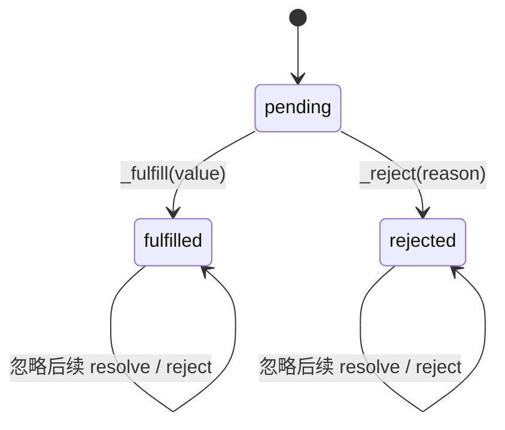
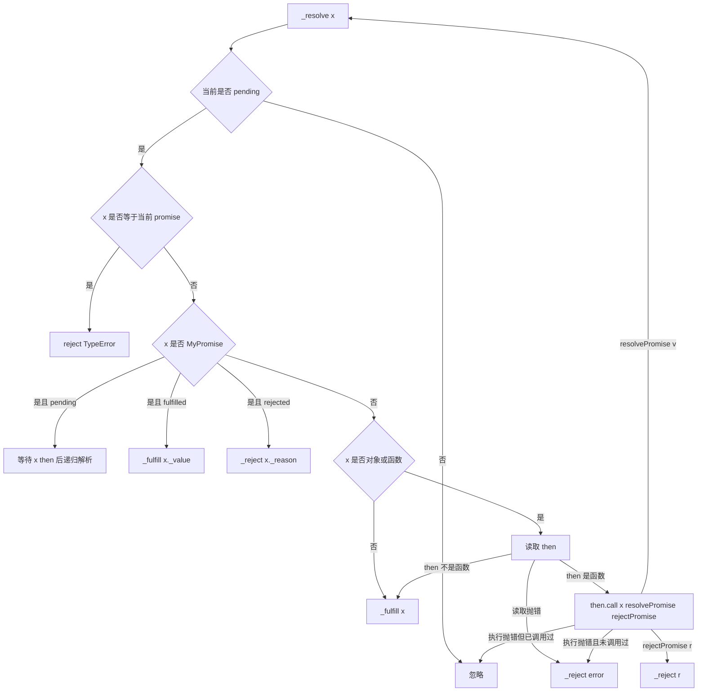
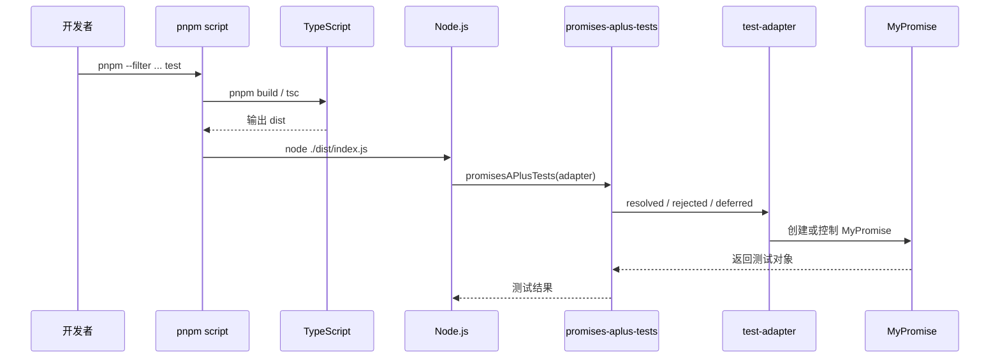

# 从 0 实现 Promise 技术文档

## 1. 背景与目标

该项目位于 `packages/promises-a-plus`，核心目标是从 0 实现一个符合 Promise A+ 规范的 `MyPromise`。项目重点覆盖 Promise 状态机、`then` 链式调用、异步回调调度、thenable 解析、异常传递和 Promise A+ 官方测试适配。

该实现不仅包含 Promise A+ 规范要求的核心能力，还补充了常用实例方法和静态方法，例如 `catch`、`finally`、`resolve`、`reject`、`all`、`allSettled`、`any`、`race`、`try` 和 `withResolvers`，方便在真实业务或教学示例中使用。

核心目标如下：

- 理解 Promise 的三态模型和状态不可逆约束。
- 实现 `then(onFulfilled, onRejected)` 的异步调用和链式返回。
- 实现 Promise Resolution Procedure，兼容普通值、`MyPromise` 和 thenable。
- 处理循环引用、重复调用、取 `then` 抛错、执行 `then` 抛错等边界情况。
- 通过 `promises-aplus-tests` 验证核心行为符合 Promise A+ 规范。

## 2. 项目范围

| 路径                                           | 说明                                   |
| ---------------------------------------------- | -------------------------------------- |
| `packages/promises-a-plus/src/MyPromise.ts`    | `MyPromise` 核心实现                   |
| `packages/promises-a-plus/src/test-adapter.js` | Promise A+ 测试适配器                  |
| `packages/promises-a-plus/src/index.js`        | 调用 `promises-aplus-tests` 的测试入口 |
| `packages/promises-a-plus/README.md`           | Promise A+ 规范摘要和学习笔记          |
| `packages/promises-a-plus/examples/2.2.6.js`   | 多次调用 `then` 的行为示例             |
| `packages/promises-a-plus/package.json`        | 包入口、脚本和依赖配置                 |
| `packages/promises-a-plus/tsconfig.json`       | TypeScript 编译配置                    |

## 3. 规范术语

Promise A+ 规范中几个核心术语如下：

| 术语      | 含义                                                                 |
| --------- | -------------------------------------------------------------------- |
| promise   | 拥有 `then` 方法，且行为符合规范的对象或函数                         |
| thenable  | 拥有 `then` 方法的对象或函数                                         |
| value     | 任意合法 JavaScript 值，包括 `undefined`、thenable 或 promise        |
| exception | 通过 `throw` 抛出的值                                                |
| reason    | promise 被拒绝的原因                                                 |
| promise1  | 调用 `then` 的原 promise                                             |
| promise2  | `then` 调用返回的新 promise                                          |
| x         | `onFulfilled` 或 `onRejected` 的返回值，用于决定 promise2 的最终状态 |

`promise1`、`promise2` 和 `x` 的关系可以表示为：

```ts
const promise2 = promise1.then(onFulfilled, onRejected);
```

其中 `onFulfilled` 或 `onRejected` 的返回值 `x` 会进入 Promise Resolution Procedure，最终决定 `promise2` 是 fulfilled 还是 rejected。

## 4. 对外 API

### 4.1 构造函数

```ts
new MyPromise<T>((resolve, reject) => {
  // 异步或同步执行任务
});
```

构造函数接收 executor，并在构造阶段立即执行。executor 同步抛出的异常会被捕获，并通过 `_reject(e)` 将当前 promise 置为 rejected。

### 4.2 实例方法

| 方法                            | 说明                                                        |
| ------------------------------- | ----------------------------------------------------------- |
| `then(onFulfilled, onRejected)` | 注册 fulfilled / rejected 回调，并返回新的 `MyPromise`      |
| `catch(onRejected)`             | `then(undefined, onRejected)` 的语法糖                      |
| `finally(onFinally)`            | 在 fulfilled 或 rejected 后执行清理逻辑，并透传原值或原拒因 |

### 4.3 静态方法

| 方法                             | 说明                                                               |
| -------------------------------- | ------------------------------------------------------------------ |
| `MyPromise.resolve(value)`       | 将普通值、thenable 或 `MyPromise` 转为 `MyPromise`                 |
| `MyPromise.reject(reason)`       | 创建 rejected 状态的 `MyPromise`                                   |
| `MyPromise.all(iterable)`        | 全部 fulfilled 后按输入顺序返回结果，任一 rejected 则立即 rejected |
| `MyPromise.allSettled(iterable)` | 等待全部结束，返回每项 fulfilled / rejected 结果                   |
| `MyPromise.any(iterable)`        | 任一 fulfilled 则成功，全部 rejected 则返回 `AggregateError`       |
| `MyPromise.race(iterable)`       | 返回第一个 settled 的结果                                          |
| `MyPromise.try(fn)`              | 执行函数并将返回值或异常包装为 `MyPromise`                         |
| `MyPromise.withResolvers()`      | 返回 `{ promise, resolve, reject }`，便于外部控制状态              |

## 5. 总体架构

```mermaid
flowchart TD
  A[new MyPromise executor] --> B{executor 执行结果}
  B -->|resolve(x)| C[_resolve x]
  B -->|reject(reason)| D[_reject reason]
  B -->|throw error| D

  C --> E{解析 x}
  E -->|x 是自身| F[reject TypeError]
  E -->|x 是 MyPromise| G[采用 x 的状态]
  E -->|x 是 thenable| H[读取并调用 then]
  E -->|普通值| I[_fulfill value]

  H -->|resolvePromise v| C
  H -->|rejectPromise r| D
  H -->|throw 且未 settled| D

  I --> J[执行 fulfilled 回调队列]
  D --> K[执行 rejected 回调队列]
  J --> L[then 返回 promise2]
  K --> L
```

架构可以拆为三层：

- 状态层：维护 `_state`、`_value`、`_reason` 和回调队列。
- 解析层：通过 `_resolve()` 实现 Promise Resolution Procedure。
- 调度层：通过 `then()` 注册回调，并使用 `queueMicrotask()` 保证回调异步执行。

## 6. 状态机设计

`MyPromise` 内部使用 `PromiseState` 枚举描述状态：

```ts
enum PromiseState {
  PENDING = "pending",
  FULFILLED = "fulfilled",
  REJECTED = "rejected",
}
```

状态转换规则如下：



核心约束：

- 初始状态只能是 `pending`。
- `pending` 可以转换为 `fulfilled` 或 `rejected`。
- 一旦进入 `fulfilled`，必须拥有不可变的 `_value`。
- 一旦进入 `rejected`，必须拥有不可变的 `_reason`。
- 终态不能再转换为其他状态，后续 `_resolve()`、`_fulfill()`、`_reject()` 调用都会被忽略。

## 7. 内部数据结构

`MyPromise` 内部维护以下字段：

| 字段                    | 说明                                  |
| ----------------------- | ------------------------------------- |
| `_state`                | 当前状态，初始值为 `pending`          |
| `_value`                | fulfilled 状态下保存的值              |
| `_reason`               | rejected 状态下保存的拒因             |
| `_onFulfilledCallbacks` | pending 阶段注册的 fulfilled 回调队列 |
| `_onRejectedCallbacks`  | pending 阶段注册的 rejected 回调队列  |

当 promise 处于 pending 时，`then()` 不会立即执行回调，而是将包装后的 `handleFulfilled` 和 `handleRejected` 放入队列。状态落定后，`_fulfill()` 或 `_reject()` 会取出对应队列并按注册顺序执行。

## 8. then 链式调用

### 8.1 then 必须返回新 promise

`then()` 每次调用都会返回一个新的 `MyPromise`，即规范中的 `promise2`：

```ts
public then<TResult1 = T, TResult2 = never>(
  onFulfilled?: OnFulfilled<T, TResult1>,
  onRejected?: OnRejected<TResult2>,
): MyPromise<TResult1 | TResult2> {
  return new MyPromise((resolve, reject) => {
    // 根据 promise1 状态注册或执行回调
  });
}
```

这使得链式调用成为可能：

```ts
MyPromise.resolve(1)
  .then((value) => value + 1)
  .then((value) => value * 2);
```

### 8.2 回调异步执行

Promise A+ 要求 `onFulfilled` 和 `onRejected` 不能在当前调用栈同步执行。本项目使用 `queueMicrotask()` 调度回调：

```ts
const handleFulfilled = () => {
  queueMicrotask(() => {
    // 执行 onFulfilled 并解析返回值
  });
};
```

这样可以保证：

- 即使 promise 已经 fulfilled，后续注册的 `then()` 回调仍异步执行。
- pending 状态落定后，队列中的回调也会异步执行。
- 行为更接近原生 Promise 的微任务语义。

### 8.3 非函数回调穿透

当 `onFulfilled` 不是函数时，`promise2` 会沿用 `promise1` 的 fulfilled 值：

```ts
if (typeof onFulfilled !== "function") {
  resolve(this._value);
}
```

当 `onRejected` 不是函数时，`promise2` 会沿用 `promise1` 的 rejected 原因：

```ts
if (typeof onRejected !== "function") {
  reject(this._reason);
}
```

这保证了值穿透和错误冒泡：

```ts
MyPromise.resolve(1)
  .then(null)
  .then((value) => value); // value 仍为 1

MyPromise.reject("error")
  .then(null)
  .catch((reason) => reason); // reason 仍为 error
```

### 8.4 回调异常处理

如果 `onFulfilled` 或 `onRejected` 执行时抛出异常，`promise2` 会以该异常作为 reason 进入 rejected 状态：

```ts
try {
  const x = onFulfilled.call(undefined, this._value);
  resolve(x);
} catch (e) {
  reject(e);
}
```

回调通过 `.call(undefined, ...)` 调用，满足规范中“回调必须作为函数调用”的要求。

## 9. Promise Resolution Procedure

`_resolve(x)` 是本实现的核心，它决定当前 promise 如何采纳 `x` 的状态或值。



### 9.1 循环引用

如果 `_resolve(x)` 收到的 `x` 与当前 promise 是同一个对象，说明发生了循环引用。此时必须 reject：

```ts
if (x === this) {
  return this._reject(new TypeError("Chaining cycle detected for promise"));
}
```

### 9.2 采纳 MyPromise 状态

当 `x instanceof MyPromise` 时，当前 promise 会采用 `x` 的最终状态：

- 如果 `x` pending，则等待 `x.then()` 后继续递归解析。
- 如果 `x` fulfilled，则使用 `x._value` fulfill 当前 promise。
- 如果 `x` rejected，则使用 `x._reason` reject 当前 promise。

### 9.3 解析 thenable

当 `x` 是对象或函数时，实现会尝试读取 `x.then`。读取过程本身可能触发 getter 并抛错，因此需要包裹在 `try...catch` 中。

如果 `then` 是函数，则使用 `x` 作为 `this` 调用：

```ts
then.call(x, resolvePromise, rejectPromise);
```

为满足规范，`resolvePromise` 和 `rejectPromise` 使用 `called` 标记保证只响应第一次调用：

```ts
let called = false;

const resolvePromise = (v: any) => {
  if (called) return;
  called = true;
  this._resolve(v);
};

const rejectPromise = (r: any) => {
  if (called) return;
  called = true;
  this._reject(r);
};
```

如果执行 `then` 时抛出异常：

- 已经调用过 `resolvePromise` 或 `rejectPromise`，忽略该异常。
- 尚未调用过二者，则使用该异常 reject 当前 promise。

## 10. catch 与 finally

### 10.1 catch

`catch()` 是 `then(undefined, onRejected)` 的语法糖：

```ts
public catch<TResult = never>(onRejected?: OnRejected<TResult>) {
  return this.then(undefined, onRejected);
}
```

它依赖 `then()` 的错误冒泡能力，可以捕获上游 rejected 状态或回调抛出的异常。

### 10.2 finally

`finally()` 在 fulfilled 和 rejected 两条路径上都会执行 `onFinally`。如果 `onFinally` 返回 promise，则等待它完成后再继续透传原值或原拒因：

```ts
return this.then(
  (value) => MyPromise.resolve(onFinally()).then(() => value),
  (reason) =>
    MyPromise.resolve(onFinally()).then(() => {
      throw reason;
    }),
);
```

关键语义：

- `finally` 不改变 fulfilled 的原值。
- `finally` 不吞掉 rejected 的原拒因。
- 如果 `onFinally` 不是函数，则直接透传原状态。

## 11. 静态组合方法

### 11.1 resolve 与 reject

`MyPromise.resolve(value)` 用于将任意值包装为 `MyPromise`。如果传入的是同构造器的 `MyPromise` 实例，则直接返回该实例，避免重复包装。

`MyPromise.reject(reason)` 直接创建 rejected promise。

### 11.2 all

`all()` 会按输入顺序收集结果：

- 输入为空时立即 fulfilled 为 `[]`。
- 每一项都会先经过 `MyPromise.resolve()` 统一包装。
- 所有项 fulfilled 后，返回结果数组。
- 任一项 rejected 时，整体立即 rejected。

### 11.3 allSettled

`allSettled()` 不会因为某一项 rejected 而提前结束。每一项都会输出结构化结果：

```ts
{
  status: ("fulfilled", value);
}
{
  status: ("rejected", reason);
}
```

全部项结束后，整体 fulfilled 为结果数组。

### 11.4 any

`any()` 表示“任一成功即可成功”：

- 输入为空时，直接 rejected 为 `AggregateError`。
- 任一项 fulfilled 时，整体立即 fulfilled。
- 全部 rejected 时，整体 rejected 为 `AggregateError`，并保留每项拒因。

### 11.5 race

`race()` 表示“第一个 settled 的结果决定整体结果”：

- 第一个 fulfilled，则整体 fulfilled。
- 第一个 rejected，则整体 rejected。
- 输入为空时，返回的 promise 会保持 pending。

### 11.6 try 与 withResolvers

`MyPromise.try(fn)` 用于将同步函数或返回 thenable 的函数统一包装为 promise。当前实现通过 executor 内的 `resolve(fn())` 完成，因此 `fn` 同步抛错时会被构造函数捕获并转为 rejected。

`MyPromise.withResolvers()` 返回外部可控的三元组：

```ts
const { promise, resolve, reject } = MyPromise.withResolvers();
```

它适合需要先创建 promise、后续再由外部事件决定状态的场景。

## 12. 测试适配

Promise A+ 官方测试依赖适配器暴露三个方法：

| 方法               | 说明                                                        |
| ------------------ | ----------------------------------------------------------- |
| `resolved(value)`  | 返回以 `value` fulfilled 的 promise                         |
| `rejected(reason)` | 返回以 `reason` rejected 的 promise                         |
| `deferred()`       | 返回 `{ promise, resolve, reject }`，由测试用例外部控制状态 |

本项目的 `src/test-adapter.js` 实现如下：

```js
const adapter = {
  resolved: (value) => MyPromise.resolve(value),
  rejected: (reason) => MyPromise.reject(reason),
  deferred: () => {
    let resolve;
    let reject;
    const promise = new MyPromise((res, rej) => {
      resolve = res;
      reject = rej;
    });
    return { promise, resolve, reject };
  },
};
```

`src/index.js` 会调用 `promises-aplus-tests(adapter, callback)`，测试失败时输出错误并以非零状态码退出，测试通过时输出 `Tests finished.`。

## 13. 构建与测试

### 13.1 包脚本

| 命令                                         | 说明                                 |
| -------------------------------------------- | ------------------------------------ |
| `pnpm --filter @lark/promises-a-plus build`  | 删除旧 `dist` 并执行 TypeScript 编译 |
| `pnpm --filter @lark/promises-a-plus test`   | 先构建，再运行 Promise A+ 测试入口   |
| `pnpm --filter @lark/promises-a-plus lint`   | 执行 ESLint 自动修复                 |
| `pnpm --filter @lark/promises-a-plus format` | 执行 Prettier 格式化                 |

### 13.2 常用命令

```bash
pnpm --filter @lark/promises-a-plus build
pnpm --filter @lark/promises-a-plus test
```

`test` 脚本实际执行链路如下：



## 14. 使用示例

### 14.1 基础链式调用

```ts
import MyPromise from "@lark/promises-a-plus";

MyPromise.resolve(1)
  .then((value) => value + 1)
  .then((value) => {
    console.log(value); // 2
  });
```

### 14.2 错误捕获

```ts
MyPromise.resolve(1)
  .then(() => {
    throw new Error("failed");
  })
  .catch((error) => {
    console.log(error.message); // failed
  });
```

### 14.3 thenable 解析

```ts
const thenable = {
  then(resolve: (value: string) => void) {
    resolve("resolved from thenable");
  },
};

MyPromise.resolve(thenable).then((value) => {
  console.log(value); // resolved from thenable
});
```

### 14.4 多次注册 then

```ts
const promise = new MyPromise<string>((resolve) => {
  setTimeout(() => resolve("done"), 1000);
});

promise.then((value) => console.log("first", value));
promise.then((value) => console.log("second", value));
promise.then((value) => console.log("third", value));
```

当 promise fulfilled 后，三个回调会按注册顺序执行。

## 15. 与 Promise A+ 的对应关系

| 规范章节            | 实现位置                            | 说明                                         |
| ------------------- | ----------------------------------- | -------------------------------------------- |
| 2.1 状态模型        | `_state`、`_fulfill()`、`_reject()` | 三态、终态不可变                             |
| 2.2 then 方法       | `then()`                            | 回调注册、异步执行、链式返回                 |
| 2.2.1 回调可选      | `then()` 内类型判断                 | 非函数回调被忽略并穿透                       |
| 2.2.4 异步调用      | `queueMicrotask()`                  | fulfilled / rejected 回调异步执行            |
| 2.2.6 多次调用 then | 回调队列                            | pending 阶段保存多个回调，落定后按序执行     |
| 2.2.7 返回 promise2 | `return new MyPromise(...)`         | 根据回调返回值解析 promise2                  |
| 2.3.1 循环引用      | `_resolve()`                        | `x === this` 时 reject TypeError             |
| 2.3.2 采纳 promise  | `_resolve()`                        | 根据 `MyPromise` 状态递归或同步采纳          |
| 2.3.3 解析 thenable | `_resolve()`                        | 读取 `then`、调用 `then`、处理重复调用和异常 |
| 2.3.4 普通值        | `_fulfill(x)`                       | 非对象 / 非函数直接 fulfilled                |

## 16. 边界与注意事项

### 16.1 实现范围

Promise A+ 只规定 `then` 和解析过程，不要求实现原生 Promise 的全部静态方法。本项目额外实现了常用静态方法，但这些方法主要服务于学习和项目内使用，完整兼容性仍应以测试覆盖为准。

### 16.2 微任务环境依赖

实现依赖 `queueMicrotask()`。当前包声明 Node.js 版本要求为 `>=22`，可以稳定使用该 API。如果需要运行在更旧环境，需要补充 polyfill 或改用其他异步调度机制。

### 16.3 类型系统不是规范的一部分

Promise A+ 是行为规范，不约束 TypeScript 泛型。本项目提供泛型签名以改善开发体验，但 thenable 深度解析后的类型推导并不等同于原生 `Promise` 的完整类型能力。

### 16.4 状态封装依赖私有字段约定

当前实现使用 TypeScript `private` 字段，而不是 ECMAScript `#private` 字段。编译后私有性主要由 TypeScript 类型系统保证，不是运行时强封装。

### 16.5 静态方法的差异点

`all`、`allSettled`、`any` 和 `race` 遵循常见 Promise 行为，但项目当前主要通过 Promise A+ 测试验证核心 `then` 规范。若这些静态方法要作为生产能力使用，应补充专门单元测试。

## 17. 后续优化方向

- 为 `catch`、`finally`、`all`、`allSettled`、`any`、`race` 增加独立单元测试。
- 增加 thenable 深度嵌套、getter 抛错、重复调用和循环引用的可读性测试用例。
- 使用 ECMAScript `#private` 字段强化运行时封装。
- 补充浏览器环境下的构建与运行验证。
- 优化 TypeScript 泛型，使 `then`、`resolve` 和组合方法的类型推导更接近原生 Promise。
