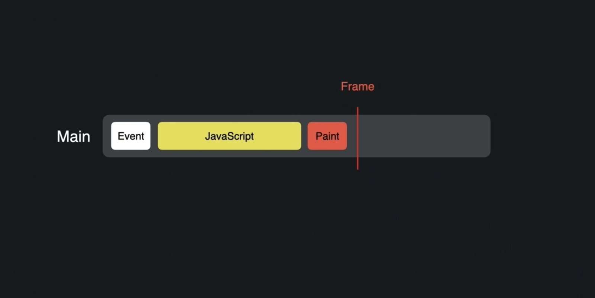
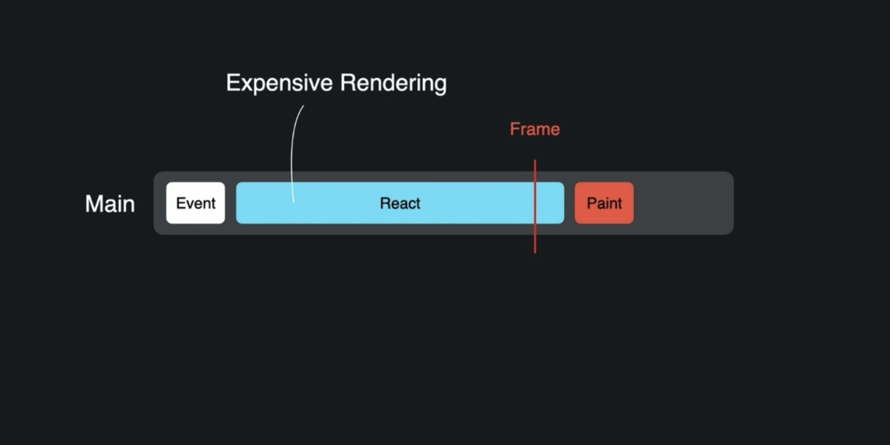
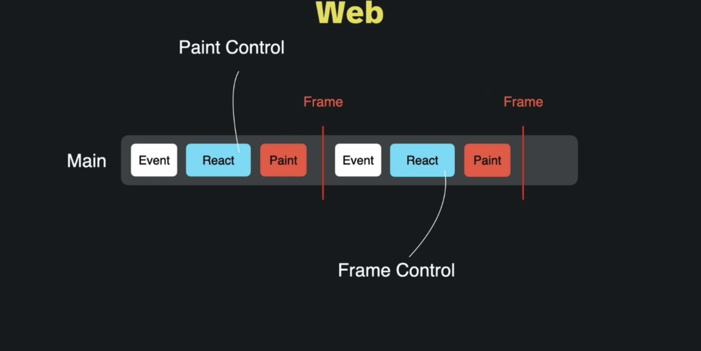
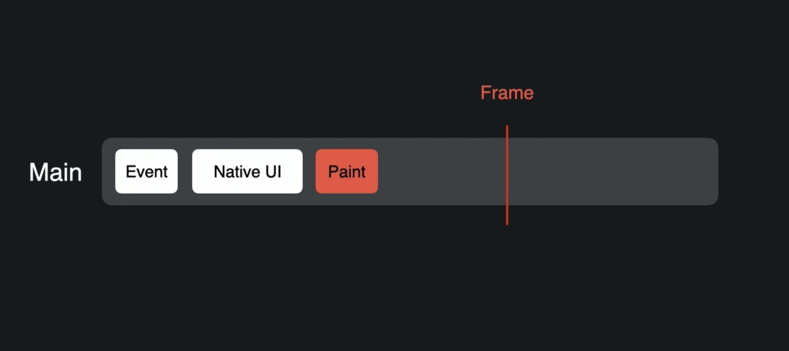
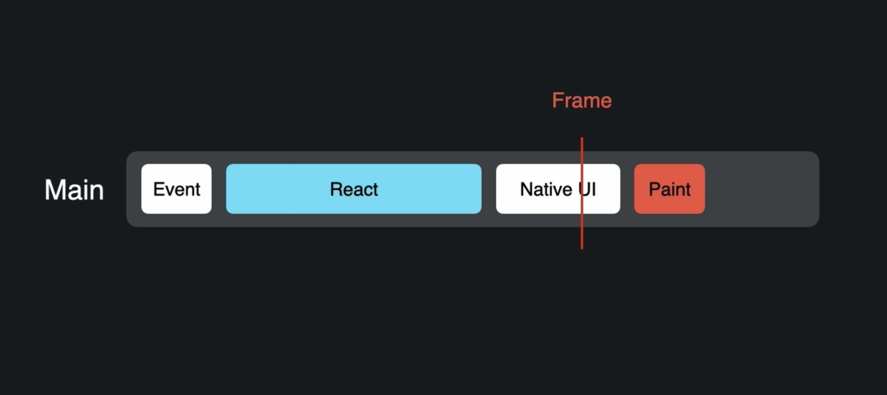
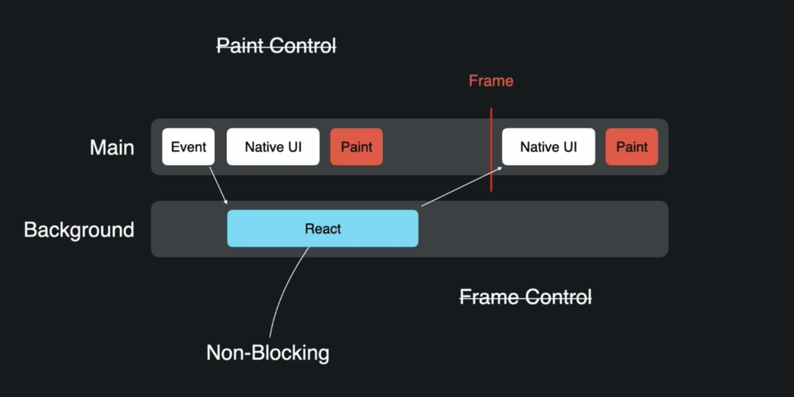
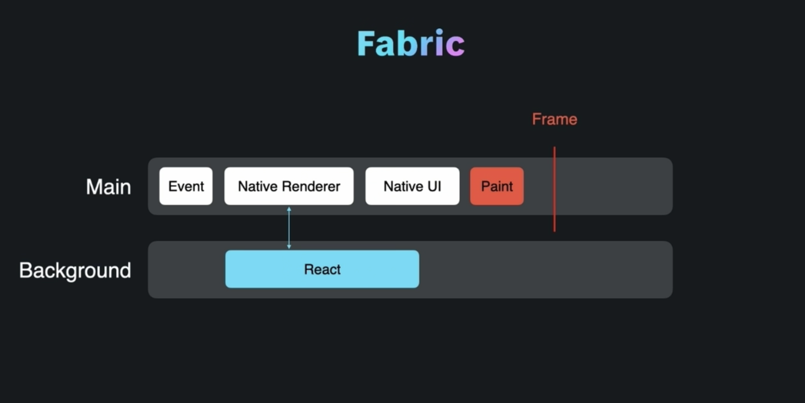
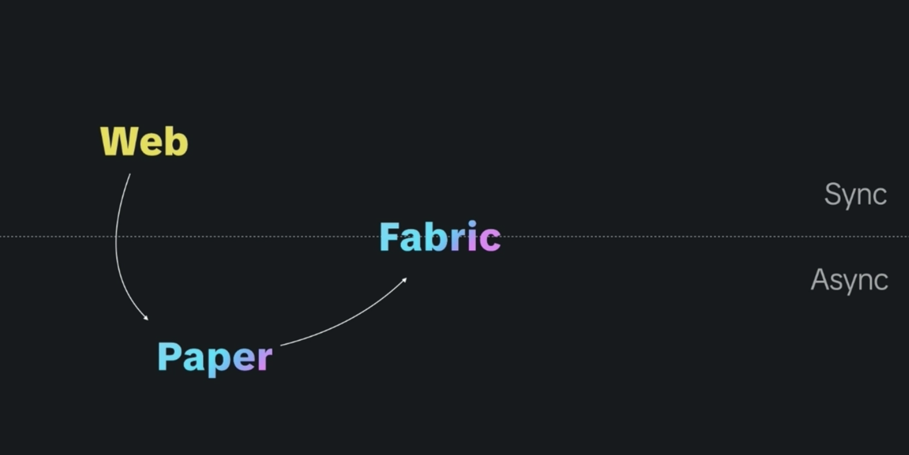

# Lynx Pomodoro

使用 react + lynx 框架开发的跨端番茄钟应用

## 技术栈

- 框架: react (@lynx-js/react) + lynx
- CSS 方案: tailwindcss
- 构建工具: rspack
- 代码 format 和 lint: biome (@biomejs/biome)

## Why lynx

虽然浏览器的进程是多线程的, 但是渲染线程和 JS 引擎线程是互斥执行的; 每一帧中只有一个 JS 引擎线程 (主线程) 执行所有的 JS 代码, 并且与负责 UI 绘制的渲染线程共享这个时间切片; 我们希望执行 JS 代码和 UI 绘制都能在下一帧前完成

- 单线程的缺点是: 如果 react 正在执行昂贵的渲染, 则可能导致「掉帧」
- - 单线程的优点是, 因为 react 直接控制主线程, 所以有 fiber 架构, react 在异步的协调阶段使用 diff 算法复用 fiber 节点找到最小更新, 在同步的提交阶将最小更新一次性的提交到真实 DOM 上, 并且可以使用 useLayoutEffect 同步测量布局

在移动平台上, JS 不再是一等公民, 由 native UI 抽象层实际驱动绘制 (而不是 JS), 如果希望使用 JS 控制 native UI, 很有可能超过帧预算 (frame budget)

如果将 react 渲染移动到后台线程, 虽然获得了非阻塞, 但是失去了精确的帧控制

react native 的新架构 fabric 中, 有一个 C++ 编写的、位于主线程的 native renderer, 参考 [About the New Architecture](https://reactnative.dev/architecture/landing-page), 主要是移除了 js 和 native 间基于 JSON 序列化的异步 bridge, 使用 javascript interface (jsi), 允许 js 拥有 C++ 对象的内存引用、同步调用, 消除序列化成本

### lynx 双线程架构

对比 react native 的 fabric 架构, 在一个 JS (background) 线程中, 使用调度器, 动态的选择同步或异步; lynx 则是双线程架构

- 主线程: 使用定制的 JS 引擎, 处理特权的、同步的 UI 任务, 例如首屏加载、高优先级事件处理
- 后台线程: 业务代码的默认执行线程, 包括 react 渲染、计算等,保证主线程低负载、不阻塞

### lynx 特点

- 首帧直出 (IFR, Instant First-Frame Rendering): 在首帧渲染完成前, 短暂的「阻塞」主线程 (我的理解是: 主线程的定制 JS 引擎足够快, 向主线程的 event loop 中插入一个大的同步任务, 以计算首帧 UI, 阻塞 UI 绘制), 消除白屏, 创造首帧直出的视觉体验
- 主线程脚本 (MTS, Main-Thread Scripting): 允许开发者将一段代码, 显式分配到主线程运行 (编译时分配到主线程, 消除跨线程通信成本), 例如手势、高优先级事件处理, 提供原生风味; 显式分配, 类似 next.js `use client;`, `use server;` 指令, lynx 是 `use main-thread`;
- 在 CSS 支持上, lynx 完胜 react native, 不需要再写 style 对象了, 全平台可以使用 tailwindcss
